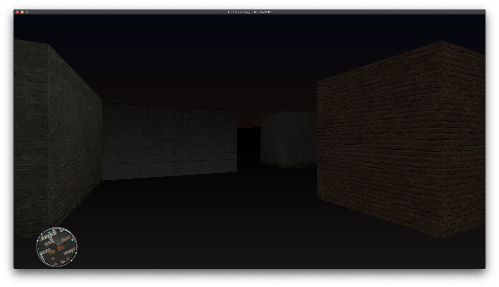
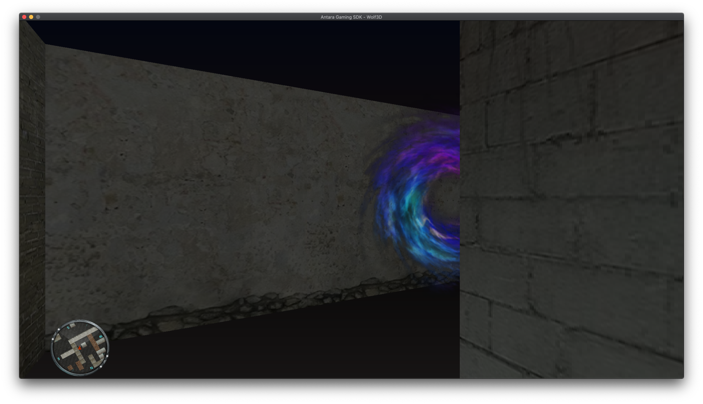
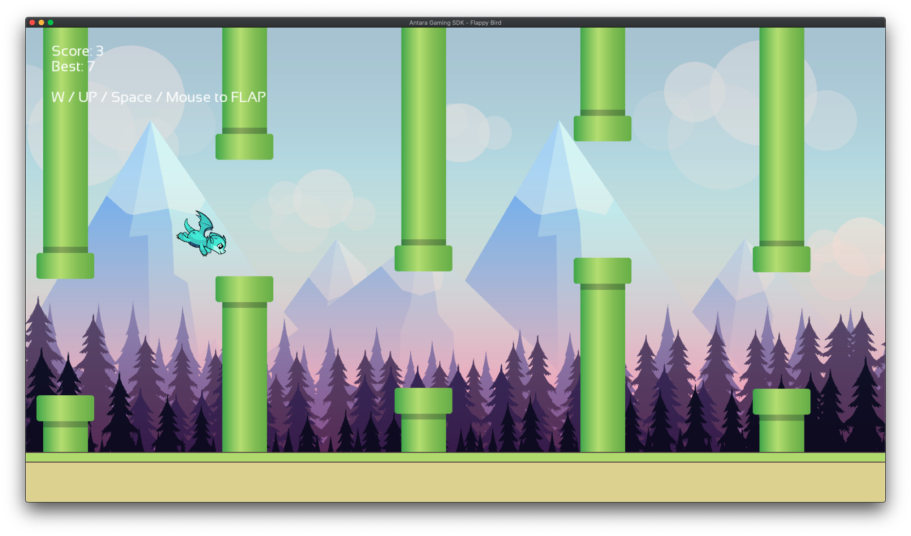

.. role:: raw-html-m2r(raw)
   :format: html

antara-gaming-sdk
=================

Antara Gaming Software Development Kit

Prerequisites
-------------

Below is the list of prerequisites to use the ``antara-gaming-sdk`` on your machine:

* `CMake <https://cmake.org/download/>`_ 3.14 minimum
* **clang-8** minimum (Windows/Linux/Osx) 
* **Optional** emscripten latest (Web)
* **Optional** Visual Studio 2019
* **Optional** Clang VS Toolset (installable through visual studio installer)

Getting Started
---------------

These instructions will get you a copy of the project up and running on your local machine for development and testing purposes. 

See deployment for notes on how to deploy the project on a live system.

Build
^^^^^

To build the project please follow the instructions below:

.. code-block:: bash

   mkdir build ## bash or powershell
   cd build ## bash or powershell

   ## Release or Debug are available
   cmake -DCMAKE_BUILD_TYPE=Debug -DCMAKE_CXX_COMPILER=your_path_to_your_clang++ ../ #Linux / Osx 
   cmake -DCMAKE_BUILD_TYPE=Debug -G "Visual Studio 16 2019" -A x64 -T "ClangCl" -DCMAKE_CXX_COMPILER="C:/Program Files/LLVM/bin/clang-cl.exe" ../ #Windows

   ## Build (Debug / Release available)
   cmake --build . --config Debug

There are also additional options with the CMake that allows to activate certain features of the SDK:

.. role:: raw-html(raw)
    :format: html

.. list-table:: Modules Tables
   :header-rows: 1
   :align: center

   * - Name
     - Description
     - How to enable it
     - Notes
   * - ``USE_SFML_ANTARA_WRAPPER``
     - Enable the SFML module of the SDK
     - ``-DUSE_SFML_ANTARA_WRAPPER=ON``
     - Requires SFML dependencies on Linux
   * - ``USE_IMGUI_ANTARA_WRAPPER``
     - Enable the IMGUI Support for the SDK
     - ``-DUSE_IMGUI_ANTARA_WRAPPER=ON``
     -
   * - ``ENABLE_BLOCKCHAIN_MODULES``
     - Enable the Blockchain modules for the SDK (need additional dependencies)
     - ``-DENABLE_BLOCKCHAIN_MODULES=ON``
     -
   * - ``ANTARA_BUILD_DOCS``
     - Enable the build of the documentation for the SDK
     - ``-DANTARA_BUILD_DOCS=ON``
     - Require Sphinx And Doxygen
   * - ``USE_LUA_ANTARA_WRAPPER``
     - Enable the lua module for the SDK
     - ``-DUSE_LUA_ANTARA_WRAPPER=ON``
     -
   * - ``USE_ASAN``
     - Enable the Address Sanitizer for the Unit tests of the SDK
     - ``-DUSE_ASAN=ON``
     - Cannot be mixed with ``USE_TSAN`` and ``USE_UBSAN``
   * - ``USE_UBSAN``
     - Enable the Undefined Behavior Sanitizer for the Unit tests of the SDK
     - ``-DUSE_UBSAN=ON``
     - Cannot be mixed with ``USE_TSAN`` and ``USE_ASAN``
   * - ``USE_TSAN``
     - Enable the Undefined Behavior Sanitizer for the Unit tests of the SDK
     - ``-DUSE_TSAN=ON``
     - Cannot be mixed with ``USE_UBSAN`` and ``USE_ASAN``
   * - ``BUILD_WITH_APPIMAGE``
     - Enable the AppImage auto-generation on Linux for bundle an executable builded with the SDK
     - ``-DBUILD_WITH_APPIMAGE=ON``
     - Work's only on ``Linux``.
   * - ``ENABLE_HTML_COMPILATION``
     - Enable the HTML Compilation on Emscripten for an executable builded with the SDK
     - ``-DENABLE_HTML_COMPILATION=ON``
     - Work's only on ``Emscripten``.
   * - ``COVERAGE_CLION_TOOLS``
     - Enable the Coverage inside CLion IDE.
     - ``-DCOVERAGE_CLION_TOOLS=ON``
     - Work's only with CLion IDE and Require ``ENABLE_COVERAGE``
   * - ``ANTARA_BUILD_EXAMPLES``
     - Enable the example of the SDK.
     - ``-DANTARA_BUILD_EXAMPLES=ON``
     - Some examples need mix of options such as ``USE_SFML_ANTARA_WRAPPER`` + ``ANTARA_BUILD_EXAMPLES``
   * - ``ANTARA_BUILD_UNIT_TESTS``
     - Enable the unit tests of the SDK.
     - ``-DANTARA_BUILD_UNIT_TESTS=ON``
     - Some examples need mix of options such as ``USE_LUA_ANTARA_WRAPPER`` + ``ANTARA_BUILD_UNIT_TESTS``
   * - ``USE_BOX2D_ANTARA_WRAPPER``
     - Enable the Box2D modules of the SDK.
     - ``-DUSE_BOX2D_ANTARA_WRAPPER=ON``
     -
   * - ``ENABLE_COVERAGE``
     - Enable the coverage macros for the SDK.
     - ``-DENABLE_COVERAGE=ON``
     -

Installing
^^^^^^^^^^

You do not need to install the gaming sdk, just use the CMake fetch_content command to use the project

Running the tests
-----------------

Once you have compiled the sdk gaming with the option to enable unit tests.

They are located in the ``bin/unit_tests`` (Linux/Osx) or ``bin/unit_tests/%CMAKE_BUILD_TYPE%`` (Windows) folder

Deployment
----------

:construction:

Built With
----------

* `doctest <https://github.com/onqtam/doctest>`_ - The fastest feature-rich C++11/14/17/20 single-header testing framework for unit tests and TDD http://bit.ly/doctest-docs (MIT)
* `doom-st <https://github.com/doom/strong_type>`_ - C++ implementation of strong types (MIT)
* `doom-meta <https://github.com/doom/meta>`_ - Just a few metaprogramming utilities in C++ (MIT)
* `EnTT <https://github.com/skypjack/entt>`_ - Gaming meets modern C++ - a fast and reliable entity-component system (ECS). (MIT)
* `refl-cpp <https://github.com/veselink1/refl-cpp>`_ A compile-time reflection library for modern C++ 🔥 (MIT)
* `range-v3 <https://github.com/ericniebler/range-v3>`_ Range library for C++14/17/20, basis for C++20's std::ranges (Boost Software License)
* `expected <https://github.com/TartanLlama/expected>`_ C++11/14/17 std::expected with functional-style extensions https://tl.tartanllama.xyz (CC0 1.0 Universal)
* (optional)\ `SFML <https://github.com/SFML/SFML>`_ Simple and Fast Multimedia Library http://www.sfml-dev.org/
* (optional)\ `reproc <https://github.com/DaanDeMeyer/reproc>`_ Cross-platform (C99/C++11) process library (MIT)

Code of Conduct
---------------

Before any contribution please read our `CODE OF CONDUCT <./CODE-OF-CONDUCT.md>`_.

Contributing
------------

Please read `CONTRIBUTING.md <./CONTRIBUTING.md>`_\ , contain the process for submitting pull requests to us.

Versioning
----------

We use `SemVer <http://semver.org/>`_ for versioning. For the versions available, see the `tags on this repository <https://github.com/KomodoPlatform/antara-gaming-sdk/tags>`_.

Authors
-------

* **Roman Sztergbaum** - *Co-Creator* & *Lead Dev* - `Milerius <https://github.com/Milerius>`_
* **Tolga Ay** - *Co-Creator* - `naezith <https://github.com/Naezith>`_

See also the list of `contributors <./CONTRIBUTORS.md>`_ who participated in this project.

Acknowledgments
---------------

* Viktor Kirilov `onqtam <https://github.com/onqtam>`_ for the awesome ``doctest`` framework.
* Michele Caini  `skypjack <https://github.com/skypjack>`_ for the awesome ``EnTT`` framework and his help.

Gallery
-------

.. image:: gallery/wolf.gif
   :align: center

.. image:: gallery/flappy-bird.gif
   :align: center
.. image:: gallery/tictactoe-gif.gif
   :align: center
.. image:: docs/assets/tictactoe_o_win.png
.. image:: docs/assets/tictactoe_x_win.png
.. image:: docs/assets/tictactoe_tie.png

Badges
------

.. list-table::
   :header-rows: 1
   :align: left

   * - Apps
     - Badges
   * - Github Actions CI (Windows/Osx/Linux)
     - .. image:: https://github.com/KomodoPlatform/antara-gaming-sdk/workflows/CI/badge.svg
          :target: https://github.com/KomodoPlatform/antara-gaming-sdk/actions
          :alt: Build Status
     
   * - License
     - :raw-html-m2r:``\ :raw-html-m2r:` `\ This work is licensed under a :raw-html-m2r:`<a rel="license" href="http://creativecommons.org/licenses/by-nc-nd/4.0/">Creative Commons Attribution-NonCommercial-NoDerivatives 4.0 International License</a>`.
   * - LGTM (Security C++) Alerts
     - .. image:: https://img.shields.io/lgtm/alerts/g/KomodoPlatform/antara-gaming-sdk.svg?logo=lgtm&logoWidth=18
          :target: https://lgtm.com/projects/g/KomodoPlatform/antara-gaming-sdk/alerts/
          :alt: Total alerts
     
   * - LGTM (Security C++) Quality
     - .. image:: https://img.shields.io/lgtm/grade/cpp/g/KomodoPlatform/antara-gaming-sdk.svg?logo=lgtm&logoWidth=18
          :target: https://lgtm.com/projects/g/KomodoPlatform/antara-gaming-sdk/context:cpp
          :alt: Language grade: C/C++
     
   * - Issues
     - .. image:: https://img.shields.io/github/issues/KomodoPlatform/antara-gaming-sdk
          :target: https://img.shields.io/github/issues/KomodoPlatform/antara-gaming-sdk
          :alt: GitHub issues
     
   * - Report CI (Linux/Osx/Windows/Emscripten)
     - .. image:: https://report.ci/status/KomodoPlatform/antara-gaming-sdk/badge.svg?branch=master
          :target: https://report.ci/status/KomodoPlatform/antara-gaming-sdk?branch=master
          :alt: badge
                                                                  
   * - Coverage (Codecov)
     - .. image:: https://codecov.io/gh/KomodoPlatform/antara-gaming-sdk/branch/master/graph/badge.svg
          :target: https://codecov.io/gh/KomodoPlatform/antara-gaming-sdk
          :alt: codecov
     
   * - Docs
     - .. image:: https://readthedocs.org/projects/antara-gaming-sdk/badge/?version=latest
          :target: https://antara-gaming-sdk.readthedocs.io/en/latest/?badge=latest
          :alt: Documentation Status
     
   * - HitCount
     - .. image:: http://hits.dwyl.io/KomodoPlatform/antara-gaming-sdk.svg
          :target: http://hits.dwyl.io/KomodoPlatform/antara-gaming-sdk
          :alt: HitCount
     
   * - Line Of Code
     - .. image:: https://tokei.rs/b1/github/KomodoPlatform/antara-gaming-sdk
          :target: https://github.com/KomodoPlatform/antara-gaming-sdk
          :alt:
     
   * - Conventional Commit
     - .. image:: https://img.shields.io/badge/Conventional%20Commits-1.0.0-yellow.svg
          :target: https://conventionalcommits.org
          :alt: Conventional Commits
     

