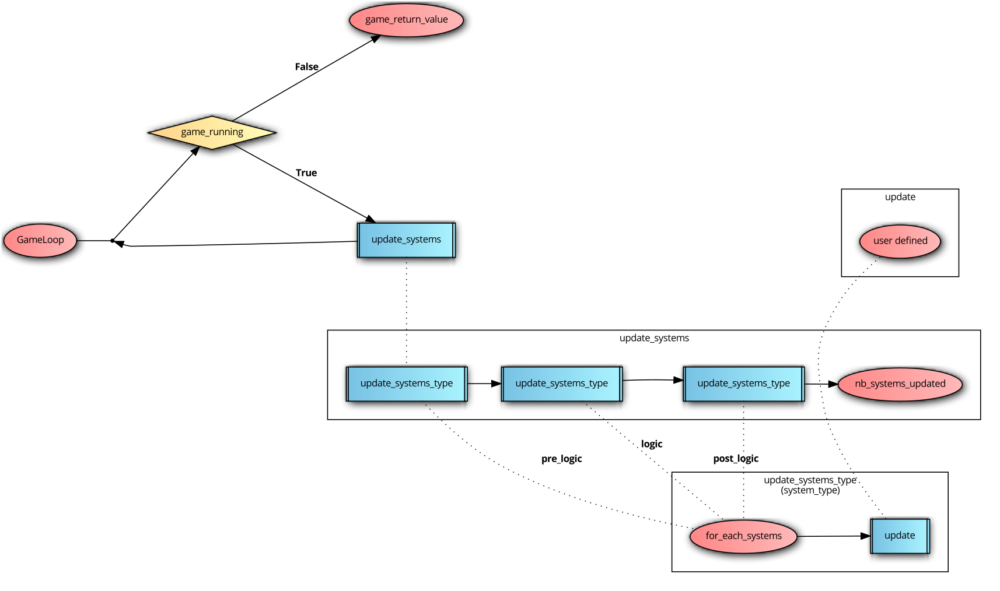

:orphan:

antara::ecs module documentation
==================================

How do the systems works ?
--------------------------

Antara Gaming SDK has 3 different kinds of systems:

* **PreUpdate**: These systems are the first to be updated in the game loop, they are generally used to retrieve user input, or manage network events for example.
* **LogicUpdate**: These systems are the second to be updated in the game loop, they are generally used for game logic such as movement or collisions for example.
* **PostUpdate**: These systems are the last to be updated in the game loop, they are generally used for rendering or interpolation for example.

The pseudo code of the game loop look like this:

.. code-block:: bash

    function update()
    {
      user defined;
    }

    function update_systems_type(system_type)
    {
      for_each_systems;
      call update();
    }

    function update_systems()
    {
      call update_systems_type(pre_logic);
      while (frame_rate) {
        call update_systems_type(logic);
      }
      call update_systems_type(post_logic);
      return nb_systems_updated
    }

    GameLoop;
    while (game_running) {
      call update_systems
    }
    return game_return_value;

Diagram
-------

Tutorial Related to Systems
---------------------------

:doc:`Click here to access systems tutorials<../tutorials/ecs>`

