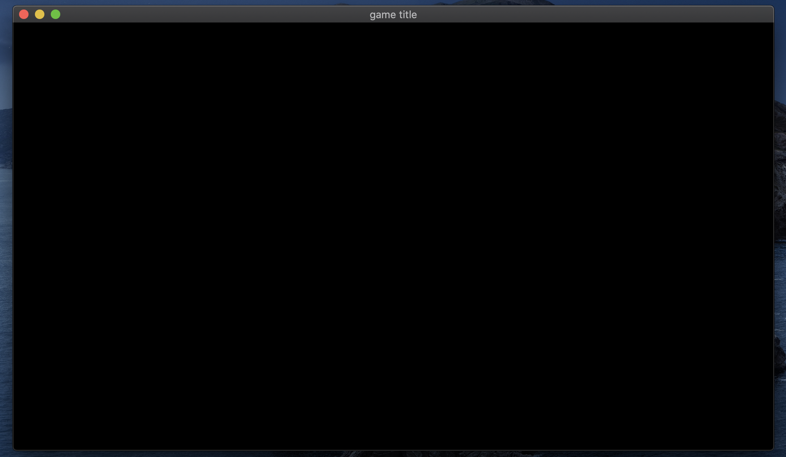
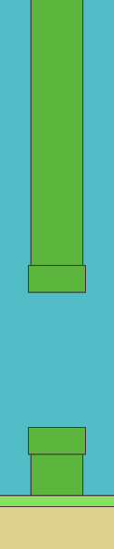

Tutorial: Flappy Bird
=====================

If you have not read the :doc:`getting started<getting_started>` part yet, Please read it before reading this one.

This tutorial is divided into multiple steps to make it easier to follow.

Step 1: Setup the executable, window and the game scene
-------------------------------------------------------

First, create a folder called ``flappy-bird`` for your project, and create another folder called ``assets`` inside. Inside ``assets`` folder. Make another folder inside named ``textures`` and place ``player.png`` inside. Then create one more folder called ``fonts`` and add ``sansation.ttf`` inside.

You should have the following tree:

.. code-block:: bash

    ./flappy-bird
    └── assets
        ├── fonts
        │   └── sansation.ttf
        └── textures
            └── player.png

Then create a text file and save it as ``CMakeLists.txt``.

In this ``CMakeLists.txt`` file we will have: name of the project, creation of the executable, link with the SDK, moving of the assets, C++ standard that will be used and extra modules that we want to use.

Below is the ``CMakeLists.txt`` file:

.. literalinclude:: ../../../tutorials/flappy-bird/step_1/CMakeLists.txt
   :language: cmake

Then we create our input file for the application and call it ``flappy-bird.cpp``.

We add an empty main function:

.. code-block:: cpp

    int main() {
        return 0;
    }

If you did everything correctly so far, you should have the following tree:

.. code-block:: bash

    ./flappy-bird
    ├── assets
    │   ├── fonts
    │   │   └── sansation.ttf
    │   └── textures
    │       └── player.png
    ├── CMakeLists.txt
    └── flappy-bird.cpp

Before continuing the tutorial, make sure that you have installed the required dependencies and your program compiles with the build commands available in the tutorial :doc:`getting started<getting_started>`.

Now we need a world representing the world of our game, to do this we use the following header file: ``#include <antara/gaming/world/world.app.hpp>``

And a basic structure that we name ``flappy_bird_world``. It will inherit from ``antara::gaming::world::app`` class.

And use the namespace ``antara::gaming`` and ``std::string_literals`` to make things easier. 

Finally, we declare our new object in the body of the main function and we replace the return value with the return value of our game returned by the ``run`` function of the ``class world::app``.

It gives us the following result:

.. code-block:: cpp

    #include <antara/gaming/world/world.hpp>

    // For convenience
    using namespace antara::gaming;
    using namespace std::string_literals;

    struct flappy_bird_world : world::app {
        // Game entry point
        flappy_bird_world() noexcept = default;
    };

    int main() {
        // Declare the world
        flappy_bird_world game;

        // Run the game
        return game.run();
    }

If you compile now and run your executable, you have an infinite loop and nothing will happen.

The last stage of this step one is to add the graphics side of the application, for that we will need two modules: ``antara::gaming::sfml::graphic_system`` and ``antara::gaming::sfml::input::system`` which have these following headers, respectively: ``#include <antara/gaming/sfml/graphic.system.hpp>`` and ``#include <antara/gaming/sfml/input.system.hpp>``.

Now in the body of the constructor of our class ``flappy_bird_world`` we will load the graphic system, then we will initialize input system with the window coming from the loaded graphic system.

.. code-block:: cpp

    // Game entry point
    flappy_bird_world() noexcept {
        // Load the graphical system
        auto &graphic_system = system_manager_.create_system<sfml::graphic_system>();

        // Load the input system with the window from the graphical system
        system_manager_.create_system<sfml::input_system>(graphic_system.get_window());
    }

If you compile and run now, you should see a black window open. You can close by pressing the close button of the window:

And now, the setup part is over. We have a ``CMakeLists.txt`` to be able to compile our program into a basic executable which can create the game window.

We will create a game scene using the scene manager. In order to do so we need to include the header file ``#include <antara/gaming/scenes/scene.manager.hpp>`` and load the scenes manager system into the system manager.

.. code-block:: cpp

    // Game entry point
    struct flappy_bird_world : world::app {
        //! Our game entry point
        flappy_bird_world() noexcept {
            // Load the graphical system
            auto &graphic_system = system_manager_.create_system<sfml::graphic_system>();

            // Load the input system with the window from the graphical system
            system_manager_.create_system<sfml::input_system>(graphic_system.get_window());

            // Load the scenes manager
            auto &scene_manager = system_manager_.create_system<scenes::manager>();
        }
    };

Now we are going to create the ``game_scene`` class that inherits from the ``base_scene`` class. This class will be the entry point of our game scene.

The concrete class must override several functions such as update, ``scene_name``.
Flappy Bird is a game that needs an update for each tick, so we will fill the update function later.
For the ``scene_name`` function we'll just return the name of the scene.

.. code-block:: cpp

    // Game Scene
    class game_scene final : public scenes::base_scene {
    public:
        game_scene(entt::registry &registry) noexcept : base_scene(registry) {
        }

        // Scene name
        std::string scene_name() noexcept final {
            return "game_scene";
        }

    private:
        // Update the game every tick
        void update() noexcept final {
        }
    };

Now we are going to load our game scene into the ``scene_manager`` using the ``change_scene`` member function

.. code-block:: cpp

    struct flappy_bird_world : world::app
    {
        //! Our game entry point
        flappy_bird_world() noexcept
        {
            //! Load the graphical system
            auto &graphic_system = system_manager_.create_system<sfml::graphic_system>();

            //! Load the input system with the window from the graphical system
            system_manager_.create_system<sfml::input_system>(graphic_system.get_window());

            //! Load the scenes manager
            auto &scene_manager = system_manager_.create_system<scenes::manager>();

            // Change the current_scene to "game_scene" by pushing it.
            scene_manager.change_scene(std::make_unique<game_scene>(entity_registry_), true);
        }
    };

We will also use a sprite for the bird, so we need the ``sfml::resources_system``. In order to do so we need to include the header file ``#include <antara/gaming/sfml/resources.manager.hpp>`` and load it in the world constructor.

.. code-block:: cpp

    // Game world
    struct flappy_bird_world : world::app {
        // Game entry point
        flappy_bird_world() noexcept {
            // Load the graphical system
            auto &graphic_system = system_manager_.create_system<sfml::graphic_system>();

            // Load the resources system
            entity_registry_.set<sfml::resources_system>(entity_registry_);

            // Load the input system with the window from the graphical system
            system_manager_.create_system<sfml::input_system>(graphic_system.get_window());

            // Load the scenes manager
            auto &scene_manager = system_manager_.create_system<scenes::manager>();

            // Change the current_scene to "game_scene" by pushing it.
            scene_manager.change_scene(std::make_unique<game_scene>(entity_registry_), true);
        }
    };

If you compile now you should still see the black window from the previous step, but we are now in our game scene.

.. note::

    The scene system is very handy to organize multiple screens of the game: **introduction scene**, **game scene**, **end-of-game scene**, etc.

Step 1 is complete, here is the full code.

.. literalinclude:: ../../../tutorials/flappy-bird/step_1/flappy-bird.cpp
   :language: cpp

Step 2: Creation of Pipes
-------------------------

At this step, we will add the pipes which Flappy Bird dies when it touches them. At the image below, you'll see two pipes with a gap between them. We will call this a ``column``. 

Let's start with the constant values that we will use. We will keep them in a struct. There are many of them:

.. code-block:: cpp

    // Constants
    struct flappy_bird_constants {
        // Pipes
        const float gap_height{265.f};
        const float column_start_distance{700.f};
        const float column_min{0.2f};
        const float column_max{0.8f};
        const float column_thickness{100.f};
        const float column_distance{400.f};
        const std::size_t column_count{6};
        const float pipe_cap_extra_width{10.f};
        const float pipe_cap_height{50.f};
        const graphics::color pipe_color{92, 181, 61};
        const graphics::outline_color pipe_outline_color{2.0f, graphics::color{76, 47, 61}};
    };

Then we will add this to the ``registry`` in the ``game_scene`` constructor.

.. code-block:: cpp

    // Game Scene
    class game_scene final : public scenes::base_scene {
    public:
        game_scene(entt::registry &registry) noexcept : base_scene(registry) {
            // Set the constants that will be used in the program
            registry.set<flappy_bird_constants>();
        }

Now let's make a struct which will represent a single ``pipe``. Instead of using a sprite, we will make graphics with basic shapes. For example, a pipe has two parts as you see in the image above: ``body`` and ``cap``. Body is being the long part of the pipe and the cap is the tip of it. Both will be green rectangle entities but with different sizes. We also prepare a ``destroy`` function which will destroy ``body`` and ``cap`` entities.

.. code-block:: cpp

    // A Flappy Bird column which has two pipes
    struct pipe {
        entt::entity body{entt::null};
        entt::entity cap{entt::null};

        // Destroy pipe
        void destroy(entt::registry &registry) {
            registry.destroy(body);
            registry.destroy(cap);
        }
    };

And like we mentioned before, two of these pipes will be called a ``column``. Here we make another struct which uses the ``struct pipe``. One is ``top_pipe``, another one is ``bottom_pipe``. Again, we have the ``destroy`` function. But this time ``destroy`` function also has an entity parameter which will be this ``column`` entity itself.

.. code-block:: cpp

    // Column is made of two pipes
    struct column {
        // Entities representing the Flappy Bird pipes
        pipe top_pipe{entt::null};
        pipe bottom_pipe{entt::null};

        // Destroy pipes and this column
        void destroy(entt::registry &registry, entt::entity entity) {
            top_pipe.destroy(registry);
            bottom_pipe.destroy(registry);
            registry.destroy(entity);
        }
    };

We will need some functions for creation of the pipes. First one is a function which returns a random number, we will use this to randomly position the gap between the pipes. We will use ``std::random_device``, ``std::mt19937``  and ``std::uniform_real_distribution<float>`` for this.

.. code-block:: cpp

    // Random number generator
    namespace {
        std::random_device rd;  // Will be used to obtain a seed for the random number engine
        std::mt19937 gen(rd()); // Standard mersenne_twister_engine seeded with rd()
        float random_float(float lower, float higher) {
            std::uniform_real_distribution<float> dist(lower, higher);
            return dist(gen);
        }
    }

We will have many entities and we need to tag them with ``game_scene`` name. And the dynamic ones will have ``dynamic`` tag, so we can easily query the dynamic ones to destroy them at reset game for example. Since this tagging will be repeated a lot, we better have a function for it. Also we'd like to have this kind of helper functions in a namespace.

.. code-block:: cpp

    namespace {
        void tag_game_scene(entt::registry &registry, entt::entity entity, bool dynamic = false) {
            // Tag game scene
            registry.assign<entt::tag<"game_scene"_hs>>(entity);

            // Tag dynamic
            if(dynamic) registry.assign<entt::tag<"dynamic"_hs>>(entity);
        }
    }

During the creation of the pipes, we will need another function, to get a random starting position of the gap. That's how we will know to start and end the top pipe, have a gap, then start and end the bottom pipe.

This function will also access to the constants, there are ``column_min`` and ``column_max``. ``column_min`` is for the top limit, ``0.2`` of the canvas height. And ``column_max`` is for the bottom limit, ``0.8`` of the canvas height. Though we also need to subtract ``gap_height`` from the ``bottom_limit`` because this will be the starting position, or the top position of the gap. When the limits are set, function returns a random float value between those two, using the random function we defined before. We add this function into the same namespace.

.. code-block:: cpp

    // Returns a random gap start position Y
    float get_random_gap_start_pos(const entt::registry &registry) {
        // Retrieve constants
        const auto canvas_height = registry.ctx<graphics::canvas_2d>().canvas.size.y();
        const auto constants = registry.ctx<flappy_bird_constants>();

        float top_limit = canvas_height * constants.column_min;
        float bottom_limit = canvas_height * constants.column_max - constants.gap_height;

        return random_float(top_limit, bottom_limit);
    }

Now we can finally start constructing a pipe. There will be some math here about position and size.

``create_pipe`` function will have ``bool is_top, float pos_x, float gap_start_pos_y`` parameters. ``is_top`` indicates if it's the top pipe or the bottom. ``pos_x`` is the horizontal position of the pipe. ``gap_start_pos_y`` is the vertical start position of the gap, which will be bottom edge of the top pipe for example. 

We can start with retrieving ``canvas_height`` and the constants. 

.. code-block:: cpp

    // Retrieve constants
    const auto canvas_height = registry.ctx<graphics::canvas_2d>().canvas.size.y();
    const auto constants = registry.ctx<flappy_bird_constants>();

Remember that pipe is made of two parts: body and cap. Let's construct the body first. It will be a rectangle so we will need center position and size. Just to avoid more complicated math, we can have center of the rectangle at the screen edge. Half of the pipe will be out of the view but it does not really matter, we don't need that optimization for this basic game. 

X will be ``pos_x``, and the Y will be top of the screen if it's the top pipe, which is 0. If it's a bottom one, then Y will be bottom edge of the screen, which is ``canvas_height``.

.. code-block:: cpp

    // PIPE BODY
    // Top pipe is at Y: 0 and bottom pipe is at canvas_height, bottom of the canvas
    transform::position_2d body_pos{pos_x, is_top ? 0.f : canvas_height};

Body size however, is pretty tricky. Size X will be the column thickness, that's easy. But the Size Y, it changes depending on if it's the top pipe or the bottom.

If it's the top pipe, start of the gap ``gap_start_pos_y`` should be bottom of the rectangle. So half size should be ``gap_start_pos_y`` since the center of the rectangle is at 0. Full size will be ``gap_start_pos_y * 2.0f``.

If it's the bottom pipe, top of the rectangle will be the end of the gap, ``gap_start_pos_y + gap_height``. So half size should be ``canvas_height - (gap_start_pos_y + gap_height)``. And we need to double it for the full size. That makes ``(canvas_height - (gap_start_pos_y + constants.gap_height)) * 2.0f``.

.. code-block:: cpp

    // Size X is the column thickness,
    // Size Y is the important part.
    // If it's a top pipe, gap_start_pos_y should be bottom of the rectangle
    //  So half size should be gap_start_pos_y since center of the rectangle is at 0.
    // If it's the bottom pipe, top of the rectangle will be at gap_start_pos_y + gap_height
    //  So half size should be canvas_height - (gap_start_pos_y + gap_height)
    // Since these are half-sizes, and the position is at the screen border, we multiply these sizes by two
    math::vec2f body_size{constants.column_thickness,
                            is_top ?
                            gap_start_pos_y * 2.0f :
                            (canvas_height - (gap_start_pos_y + constants.gap_height)) * 2.0f};

To construct the rectangle entity, we can use blueprint function ``geometry::blueprint_rectangle``. We will also feed ``pipe_color`` and ``pipe_outline_color`` which also has thickness info in it.

.. code-block:: cpp

    auto body = geometry::blueprint_rectangle(registry, body_size, constants.pipe_color, body_pos, constants.pipe_outline_color);

That's it for the body! Now we need to construct the cap of the pipe.

Size of the cap will be ``column_thickness`` plus ``pipe_cap_extra_width`` because we want the cap to look like the mario pipe, cap needs to be a little bit wider. And the height is pre-defined ``pipe_cap_height``. Easy!

.. code-block:: cpp

    // PIPE CAP
    // Let's prepare the pipe cap
    // Size of the cap is defined in constants
    math::vec2f cap_size{constants.column_thickness + constants.pipe_cap_extra_width, constants.pipe_cap_height};

Cap position is a bit trickier, X position will be same as the body, ``body_pos.x()`` since it's centered. But the Y position changes depending on if it's a top one or bottom.

If it's the top cap, bottom line of the cap is alligned with bottom of the body or start of the gap which is the same line. We will use start of the gap here, minus half of the cap height, because position is the center of the rectangle. It makes ``gap_start_pos_y - constants.pipe_cap_height * 0.5f``.

If it's the bottom cap, bottom of the gap will be the same line as top of the cap. Bottom of the gap is gap start position plus the gap height, ``gap_start_pos_y + constants.gap_height``. Then we need to add half of the pipe height again because we want the shift a little bit down since the position we define is the center of the cap and we want the top to be alligned with top of the body.

.. code-block:: cpp

    // Position, X is same as the body. Bottom of the cap is aligned with bottom of the body,
    // or start of the gap, we will use start of the gap here, minus half of the cap height
    transform::position_2d cap_pos{body_pos.x(),
                                    is_top ?
                                    gap_start_pos_y - constants.pipe_cap_height * 0.5f :
                                    gap_start_pos_y + constants.gap_height + constants.pipe_cap_height * 0.5f
    };

To construct the rectangle entity, we can use blueprint function ``geometry::blueprint_rectangle``. We will also feed ``pipe_color`` and ``pipe_outline_color`` again, colors are same as the body.

.. code-block:: cpp

    auto cap = geometry::blueprint_rectangle(registry, cap_size, constants.pipe_color, cap_pos, constants.pipe_outline_color);

To make cap appear in front of the body, we need to define the draw order. We will use ``graphics::layer`` for that. Higher is front, lower is back. We set ``cap`` as ``layer<4>`` and ``body`` as ``layer<3>``.

.. code-block:: cpp

    // Set layers, cap should be in front of body
    registry.assign<graphics::layer<4>>(cap);
    registry.assign<graphics::layer<3>>(body);

Then tag both entities as ``game_scene`` and ``dynamic`` with the ``tag_game_scene`` function we defined before. Then return both inside ``{ }`` that will automatically construct a ``struct pipe``.

.. code-block:: cpp

    tag_game_scene(registry, cap, true);
    tag_game_scene(registry, body, true);

    // Construct a pipe with body and cap and return it
    return {body, cap};

Whole function looks like this:

.. code-block:: cpp

    // Factory for pipes, requires to know if it's a top one, position x of the column, and the gap starting position Y
    pipe create_pipe(entt::registry &registry, bool is_top, float pos_x, float gap_start_pos_y) {
        // Retrieve constants
        const auto canvas_height = registry.ctx<graphics::canvas_2d>().canvas.size.y();
        const auto constants = registry.ctx<flappy_bird_constants>();

        // PIPE BODY
        // Top pipe is at Y: 0 and bottom pipe is at canvas_height, bottom of the canvas
        transform::position_2d body_pos{pos_x, is_top ? 0.f : canvas_height};

        // Size X is the column thickness,
        // Size Y is the important part.
        // If it's a top pipe, gap_start_pos_y should be bottom of the rectangle
        //  So half size should be gap_start_pos_y since center of the rectangle is at 0.
        // If it's the bottom pipe, top of the rectangle will be at gap_start_pos_y + gap_height
        //  So half size should be canvas_height - (gap_start_pos_y + gap_height)
        // Since these are half-sizes, and the position is at the screen border, we multiply these sizes by two
        math::vec2f body_size{constants.column_thickness,
                              is_top ?
                              gap_start_pos_y * 2.0f :
                              (canvas_height - (gap_start_pos_y + constants.gap_height)) * 2.0f};

        auto body = geometry::blueprint_rectangle(registry, body_size, constants.pipe_color, body_pos,
                                                  constants.pipe_outline_color);

        // PIPE CAP
        // Let's prepare the pipe cap
        // Size of the cap is defined in constants
        math::vec2f cap_size{constants.column_thickness + constants.pipe_cap_extra_width, constants.pipe_cap_height};

        // Position, X is same as the body. Bottom of the cap is aligned with bottom of the body,
        // or start of the gap, we will use start of the gap here, minus half of the cap height
        transform::position_2d cap_pos{body_pos.x(),
                                       is_top ?
                                       gap_start_pos_y - constants.pipe_cap_height * 0.5f :
                                       gap_start_pos_y + constants.gap_height + constants.pipe_cap_height * 0.5f
        };

        // Construct the cap
        auto cap = geometry::blueprint_rectangle(registry, cap_size, constants.pipe_color, cap_pos,
                                                 constants.pipe_outline_color);

        // Set layers, cap should be in front of body
        registry.assign<graphics::layer<4>>(cap);
        registry.assign<graphics::layer<3>>(body);
        tag_game_scene(registry, cap, true);
        tag_game_scene(registry, body, true);

        // Construct a pipe with body and cap and return it
        return {body, cap};
    }

Since we are able to make a single pipe now, we can build a full column which has two pipes.

Let's make the function ``void create_column(entt::registry &registry, float pos_x)``. Only parameter it will have is the X position of the column, ``pos_x``.

We start with creating an empty entity.

.. code-block:: cpp

    // Create a fresh entity for a new column
    auto entity_column = registry.create();

Then get a random vertical position for start of the gap with the function we made before, ``get_random_gap_start_pos``.

.. code-block:: cpp

    // Get a random gap start position Y, between pipes
    float gap_start_pos_y = get_random_gap_start_pos(registry);

Create ``top_pipe`` and ``bottom_pipe`` with the ``create_pipe`` function we made, only parameter that varies between two is ``is_top`` boolean is true for the ``top_pipe``.

.. code-block:: cpp

    // Create pipes, is_top variable is false for bottom one
    auto top_pipe = create_pipe(registry, true, pos_x, gap_start_pos_y);
    auto bottom_pipe = create_pipe(registry, false, pos_x, gap_start_pos_y);
    
Now we can construct a ``struct column`` with these two, tag it with ``column`` name. Then use the ``tag_game_scene`` function to tag it with ``game_scene`` and ``dynamic``.

.. code-block:: cpp

    // Make a column from these two pipes and mark it as "column"
    registry.assign<column>(entity_column, top_pipe, bottom_pipe);
    registry.assign<entt::tag<"column"_hs>>(entity_column);
    tag_game_scene(registry, entity_column, true);

Whole function looks like this:

.. code-block:: cpp

    // Factory to create single column
    void create_column(entt::registry &registry, float pos_x) noexcept {
        // Create a fresh entity for a new column
        auto entity_column = registry.create();

        // Get a random gap start position Y, between pipes
        float gap_start_pos_y = get_random_gap_start_pos(registry);

        // Create pipes, is_top variable is false for bottom one
        auto top_pipe = create_pipe(registry, true, pos_x, gap_start_pos_y);
        auto bottom_pipe = create_pipe(registry, false, pos_x, gap_start_pos_y);

        // Make a column from these two pipes and mark it as "column"
        registry.assign<column>(entity_column, top_pipe, bottom_pipe);
        registry.assign<entt::tag<"column"_hs>>(entity_column);
        tag_game_scene(registry, entity_column, true);
    }

We want many of these columns, so we need to make a ``create_columns`` function. 

We will need constants again, retrieve them.

.. code-block:: cpp

    // Retrieve constants
    const auto constants = registry.ctx<flappy_bird_constants>();

Columns at Flappy Bird start coming from far away, so we have a ``column_start_distance`` to add that offset. And an additional ``constants.column_thickness * 2.0f`` to make sure they are out of the screen if ``column_start_distance`` is set as ``canvas_width``.

.. code-block:: cpp

    // Spawn columns far away
    const float column_pos_offset = constants.column_start_distance + constants.column_thickness * 2.0f;

Then very easily create columns using ``create_column`` function in a ``for loop``. For count, we use ``column_count`` constant. And to add distance between every column, we can use the counter ``i`` which increments by one, multiplying ``i`` with ``column_distance`` puts each column further than the previous one. Finally, add the ``column_pos_offset`` offset and the loop will look like this:

.. code-block:: cpp

    // Create the columns
    for (std::size_t i = 0; i < constants.column_count; ++i) {
        // Horizontal position (X) increases for every column, keeping the distance
        float pos_x = column_pos_offset + i * constants.column_distance;

        create_column(registry, pos_x);
    }

Whole function looks like this:

.. code-block:: cpp

    // Factory for creating a Flappy Bird columns
    void create_columns(entt::registry &registry) noexcept {
        // Retrieve constants
        const auto constants = registry.ctx<flappy_bird_constants>();

        // Spawn columns out of the screen, out of the canvas
        const float column_pos_offset = constants.column_start_distance + constants.column_thickness * 2.0f;

        // Create the columns
        for (std::size_t i = 0; i < constants.column_count; ++i) {
            // Horizontal position (X) increases for every column, keeping the distance
            float pos_x = column_pos_offset + i * constants.column_distance;

            create_column(registry, pos_x);
        }
    }

We need to call this ``create_columns`` function at initialization. Let's make an initialization function for dynamic objects.

.. code-block:: cpp

    // Initialize dynamic objects, this function is called at start and resets
    void init_dynamic_objects(entt::registry &registry) {
        create_columns(registry);
    }

And call it in the ``game_scene`` constructor:

.. code-block:: cpp

    game_scene(entt::registry &registry) noexcept : base_scene(registry) {
        // Set the constants that will be used in the program
        registry.set<flappy_bird_constants>();

        // Create everything
        init_dynamic_objects(registry);
    }

That's it! Now we have many columns being drawn:

