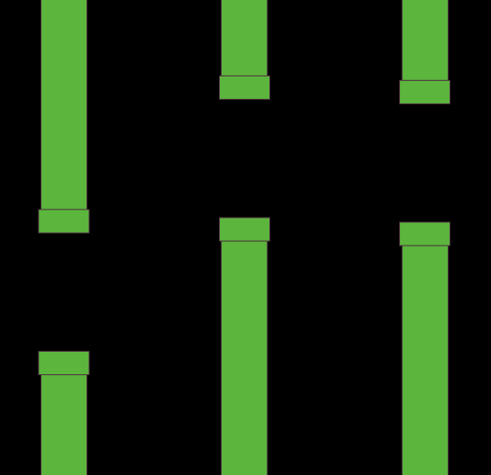
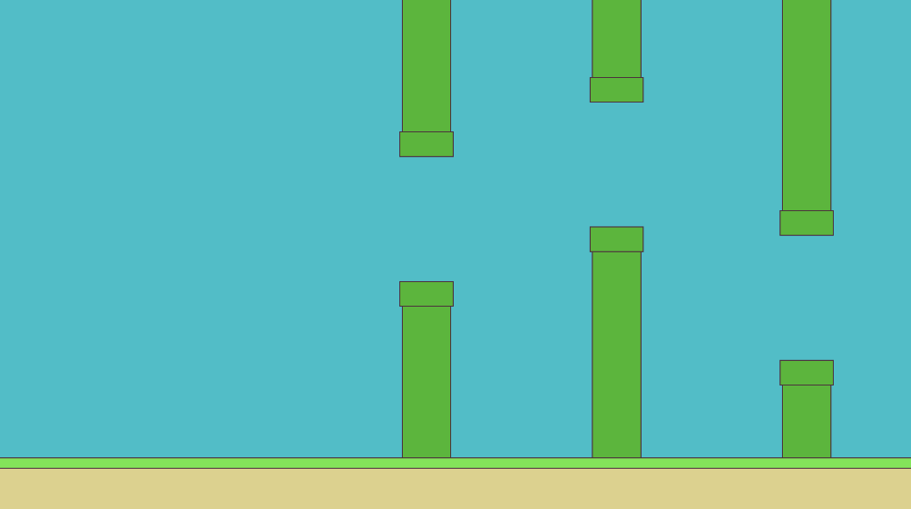
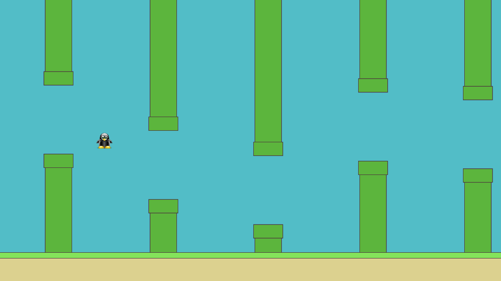
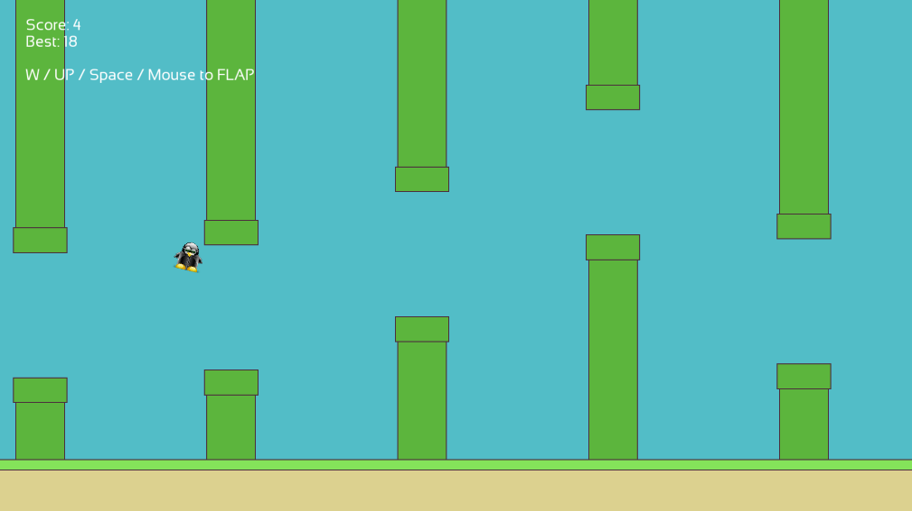

Tutorial: Flappy Bird
=====================

If you have not read the :doc:`getting started<getting_started>` part yet, Please read it before reading this one.

This tutorial is divided into multiple steps to make it easier to follow.

Step 1: Setup the executable, window and the game scene
-------------------------------------------------------

First, create a folder called ``flappy-bird`` for your project, and create another folder called ``assets`` inside. Inside ``assets`` folder. Make another folder inside named ``textures`` and place ``player.png`` inside.
Make another folder called ``data`` with ``linux`` and ``osx`` subfolder.

The data folder contains utility files for installing the game on targeted systems.

In the Linux folder we need three files:

- komodo_icon.png (Icons of our game)
- org.antara.gaming.sfml.flappybird.appdata.xml (xml definition for our game)
- org.antara.gaming.sfml.flappybird.desktop (desktop file for Linux)

Here is the icon of the game that we will use for the tutorials:

Here is the xml file:

.. literalinclude:: ../../../tutorials/flappy-bird/step_1/data/linux/org.antara.gaming.sfml.flappybird.appdata.xml
   :language: xml

Here is the desktop file:

.. literalinclude:: ../../../tutorials/flappy-bird/step_1/data/linux/org.antara.gaming.sfml.flappybird.desktop

In the OSX folder we need four files:

- kmd_logo.icns (icon osx format of our game)
- Packaging_CMakeDMGBackground.tif (dmg image background)
- Packaging_CMakeDMGSetup.scpt (OSX Apple script for the packaging)
- sfml_flappybird_install.cmake (CMake script for the bundling)

For downloading kmd_logo.icns it:

ClickHere_

.. _ClickHere: https://antara-gaming-sdk.readthedocs.io/en/latest/_images/kmd_logo.icns

Here is the Packaging_CMakeDMGBackground.tif:

Click_

.. _Click: https://antara-gaming-sdk.readthedocs.io/en/latest/_images/Packaging_CMakeDMGBackground.tif

Here is the AppleScript:

.. literalinclude:: ../../../tutorials/flappy-bird/step_1/data/osx/Packaging_CMakeDMGSetup.scpt

And finally the CMake script:

.. literalinclude:: ../../../tutorials/flappy-bird/step_1/data/osx/sfml_flappybird_install.cmake
   :language: cmake

You should have the following tree:

.. code-block:: bash

    ./flappy-bird
    ├── assets
    │  ├── config
    │  │  └── game.config.maker.json
    │  └── textures
    │     └── player.png
    ├── CMakeLists.txt
    ├── data
    │  ├── linux
    │  │  ├── komodo_icon.png
    │  │  ├── org.antara.gaming.sfml.flappybird.appdata.xml
    │  │  └── org.antara.gaming.sfml.flappybird.desktop
    │  └── osx
    │     ├── kmd_logo.icns
    │     ├── Packaging_CMakeDMGBackground.tif
    │     ├── Packaging_CMakeDMGSetup.scpt
    │     └── sfml_flappybird_install.cmake
    └── flappy-bird.cpp

Then create a text file and save it as ``CMakeLists.txt``.

In this ``CMakeLists.txt`` file we will have: name of the project, creation of the executable, link with the SDK, moving of the assets, C++ standard that will be used and extra modules that we want to use.

Below is the ``CMakeLists.txt`` file:

.. literalinclude:: ../../../tutorials/flappy-bird/step_1/CMakeLists.txt
   :language: cmake

Then we create our input file for the application and call it ``flappy-bird.cpp``.

We add an empty main function:

.. code-block:: cpp

    int main() {
        return 0;
    }

If you did everything correctly so far, you should have the following tree:

.. code-block:: bash

    ./flappy-bird
    ├── assets
    │   ├── fonts
    │   │   └── sansation.ttf
    │   └── textures
    │       └── player.png
    ├── CMakeLists.txt
    └── flappy-bird.cpp

Before continuing the tutorial, make sure that you have installed the required dependencies and your program compiles with the build commands available in the tutorial :doc:`getting started<getting_started>`.

Now we need a world representing the world of our game, to do this we use the following header file: ``#include <antara/gaming/world/world.app.hpp>``

And a basic structure that we name ``flappy_bird_world``. It will inherit from ``antara::gaming::world::app`` class.

And use the namespace ``antara::gaming`` and ``std::string_literals`` to make things easier. 

Finally, we declare our new object in the body of the main function and we replace the return value with the return value of our game returned by the ``run`` function of the ``class world::app``.

It gives us the following result:

.. code-block:: cpp

    #include <antara/gaming/world/world.hpp>

    // For convenience
    using namespace antara::gaming;
    using namespace std::string_literals;

    struct flappy_bird_world : world::app {
        // Game entry point
        flappy_bird_world() noexcept = default;
    };

    int main() {
        // Declare the world
        flappy_bird_world game;

        // Run the game
        return game.run();
    }

If you compile now and run your executable, you have an infinite loop and nothing will happen.

The last stage of this step one is to add the graphics side of the application, for that we will need two modules: ``antara::gaming::sfml::graphic_system`` and ``antara::gaming::sfml::input::system`` which have these following headers, respectively: ``#include <antara/gaming/sfml/graphic.system.hpp>`` and ``#include <antara/gaming/sfml/input.system.hpp>``.

Now in the body of the constructor of our class ``flappy_bird_world`` we will load the graphic system, then we will initialize input system with the window coming from the loaded graphic system.

.. code-block:: cpp

    // Game entry point
    flappy_bird_world() noexcept {
        // Load the graphical system
        auto &graphic_system = system_manager_.create_system<sfml::graphic_system>();

        // Load the input system with the window from the graphical system
        system_manager_.create_system<sfml::input_system>(graphic_system.get_window());
    }

If you compile and run now, you should see a black window open. You can close by pressing the close button of the window:

.. image:: ../../assets/black_window.png

And now, the setup part is over. We have a ``CMakeLists.txt`` to be able to compile our program into a basic executable which can create the game window.

We will create a game scene using the scene manager. In order to do so we need to include the header file ``#include <antara/gaming/scenes/scene.manager.hpp>`` and load the scenes manager system into the system manager.

.. code-block:: cpp

    // Game entry point
    struct flappy_bird_world : world::app {
        //! Our game entry point
        flappy_bird_world() noexcept {
            // Load the graphical system
            auto &graphic_system = system_manager_.create_system<sfml::graphic_system>();

            // Load the input system with the window from the graphical system
            system_manager_.create_system<sfml::input_system>(graphic_system.get_window());

            // Load the scenes manager
            auto &scene_manager = system_manager_.create_system<scenes::manager>();
        }
    };

Now we are going to create the ``game_scene`` class that inherits from the ``base_scene`` class. This class will be the entry point of our game scene.

The concrete class must override several functions such as update, ``scene_name``.
Flappy Bird is a game that needs an update for each tick, so we will fill the update function later.
For the ``scene_name`` function we'll just return the name of the scene.

.. code-block:: cpp

    // Game Scene
    class game_scene final : public scenes::base_scene {
    public:
        game_scene(entt::registry &registry) noexcept : base_scene(registry) {
        }

        // Scene name
        std::string scene_name() noexcept final {
            return "game_scene";
        }

    private:
        // Update the game every tick
        void update() noexcept final {
        }
    };

Now we are going to load our game scene into the ``scene_manager`` using the ``change_scene`` member function

.. code-block:: cpp

    struct flappy_bird_world : world::app
    {
        //! Our game entry point
        flappy_bird_world() noexcept
        {
            //! Load the graphical system
            auto &graphic_system = system_manager_.create_system<sfml::graphic_system>();

            //! Load the input system with the window from the graphical system
            system_manager_.create_system<sfml::input_system>(graphic_system.get_window());

            //! Load the scenes manager
            auto &scene_manager = system_manager_.create_system<scenes::manager>();

            // Change the current_scene to "game_scene" by pushing it.
            scene_manager.change_scene(std::make_unique<game_scene>(entity_registry_), true);
        }
    };

We will also use a sprite for the bird, so we need the ``sfml::resources_system``. In order to do so we need to include the header file ``#include <antara/gaming/sfml/resources.manager.hpp>`` and load it in the world constructor.

.. code-block:: cpp

    // Game world
    struct flappy_bird_world : world::app {
        // Game entry point
        flappy_bird_world() noexcept {
            // Load the graphical system
            auto &graphic_system = system_manager_.create_system<sfml::graphic_system>();

            // Load the resources system
            entity_registry_.set<sfml::resources_system>(entity_registry_);

            // Load the input system with the window from the graphical system
            system_manager_.create_system<sfml::input_system>(graphic_system.get_window());

            // Load the scenes manager
            auto &scene_manager = system_manager_.create_system<scenes::manager>();

            // Change the current_scene to "game_scene" by pushing it.
            scene_manager.change_scene(std::make_unique<game_scene>(entity_registry_), true);
        }
    };

If you compile now you should still see the black window from the previous step, but we are now in our game scene.

.. image:: ../../assets/black_window.png

.. note::

    The scene system is very handy to organize multiple screens of the game: **introduction scene**, **game scene**, **end-of-game scene**, etc.

Step 1 is complete, here is the full code.

.. literalinclude:: ../../../tutorials/flappy-bird/step_1/flappy-bird.cpp
   :language: cpp

Step 2: Creation of Pipes
-------------------------

At this step, we will add the pipes which Flappy Bird dies when it touches them. At the image below, you'll see two pipes with a gap between them. We will call this a ``column``. 

.. image:: ../../assets/fb_column.png

Let's start with the constant values that we will use. We will keep them in a struct. There are many of them:

.. code-block:: cpp

    // Constants
    struct flappy_bird_constants {
        // Pipes
        const float gap_height{265.f};
        const float column_start_distance{700.f};
        const float column_min{0.2f};
        const float column_max{0.8f};
        const float column_thickness{100.f};
        const float column_distance{400.f};
        const std::size_t column_count{6};
        const float pipe_cap_extra_width{10.f};
        const float pipe_cap_height{50.f};
        const graphics::color pipe_color{92, 181, 61};
        const graphics::outline_color pipe_outline_color{2.0f, graphics::color{76, 47, 61}};
    };

Then we will add this to the ``registry`` in the ``game_scene`` constructor.

.. code-block:: cpp

    // Game Scene
    class game_scene final : public scenes::base_scene {
    public:
        game_scene(entt::registry &registry) noexcept : base_scene(registry) {
            // Set the constants that will be used in the program
            registry.set<flappy_bird_constants>();
        }

Now let's make a struct which will represent a single ``pipe``. Instead of using a sprite, we will make graphics with basic shapes. For example, a pipe has two parts as you see in the image above: ``body`` and ``cap``. Body is being the long part of the pipe and the cap is the tip of it. Both will be green rectangle entities but with different sizes. We also prepare a ``destroy`` function which will destroy ``body`` and ``cap`` entities.

.. code-block:: cpp

    // A Flappy Bird column which has two pipes
    struct pipe {
        entt::entity body{entt::null};
        entt::entity cap{entt::null};

        // Destroy pipe
        void destroy(entt::registry &registry) {
            registry.destroy(body);
            registry.destroy(cap);
        }
    };

And like we mentioned before, two of these pipes will be called a ``column``. Here we make another struct which uses the ``struct pipe``. One is ``top_pipe``, another one is ``bottom_pipe``. Again, we have the ``destroy`` function. But this time ``destroy`` function also has an entity parameter which will be this ``column`` entity itself.

.. code-block:: cpp

    // Column is made of two pipes
    struct column {
        // Entities representing the Flappy Bird pipes
        pipe top_pipe{entt::null};
        pipe bottom_pipe{entt::null};

        // Destroy pipes and this column
        void destroy(entt::registry &registry, entt::entity entity) {
            top_pipe.destroy(registry);
            bottom_pipe.destroy(registry);
            registry.destroy(entity);
        }
    };

We will need some functions for creation of the pipes. First one is a function which returns a random number, we will use this to randomly position the gap between the pipes. We will use ``std::random_device``, ``std::mt19937``  and ``std::uniform_real_distribution<float>`` for this.

.. code-block:: cpp

    // Random number generator
    namespace {
        std::random_device rd;  // Will be used to obtain a seed for the random number engine
        std::mt19937 gen(rd()); // Standard mersenne_twister_engine seeded with rd()
        float random_float(float lower, float higher) {
            std::uniform_real_distribution<float> dist(lower, higher);
            return dist(gen);
        }
    }

We will have many entities and we need to tag them with ``game_scene`` name. And the dynamic ones will have ``dynamic`` tag, so we can easily query the dynamic ones to destroy them at reset game for example. Since this tagging will be repeated a lot, we better have a function for it. Also we'd like to have this kind of helper functions in a namespace.

.. code-block:: cpp

    namespace {
        void tag_game_scene(entt::registry &registry, entt::entity entity, bool dynamic = false) {
            // Tag game scene
            registry.assign<entt::tag<"game_scene"_hs>>(entity);

            // Tag dynamic
            if(dynamic) registry.assign<entt::tag<"dynamic"_hs>>(entity);
        }
    }

During the creation of the pipes, we will need another function, to get a random starting position of the gap. That's how we will know to start and end the top pipe, have a gap, then start and end the bottom pipe.

This function will also access to the constants, there are ``column_min`` and ``column_max``. ``column_min`` is for the top limit, ``0.2`` of the canvas height. And ``column_max`` is for the bottom limit, ``0.8`` of the canvas height. Though we also need to subtract ``gap_height`` from the ``bottom_limit`` because this will be the starting position, or the top position of the gap. When the limits are set, function returns a random float value between those two, using the random function we defined before. We add this function into the same namespace.

.. code-block:: cpp

    // Returns a random gap start position Y
    float get_random_gap_start_pos(const entt::registry &registry) {
        // Retrieve constants
        const auto canvas_height = registry.ctx<graphics::canvas_2d>().canvas.size.y();
        const auto constants = registry.ctx<flappy_bird_constants>();

        float top_limit = canvas_height * constants.column_min;
        float bottom_limit = canvas_height * constants.column_max - constants.gap_height;

        return random_float(top_limit, bottom_limit);
    }

Now we can finally start constructing a pipe. There will be some math here about position and size.

``create_pipe`` function will have ``bool is_top, float pos_x, float gap_start_pos_y`` parameters. ``is_top`` indicates if it's the top pipe or the bottom. ``pos_x`` is the horizontal position of the pipe. ``gap_start_pos_y`` is the vertical start position of the gap, which will be bottom edge of the top pipe for example. 

We can start with retrieving ``canvas_height`` and the constants. 

.. code-block:: cpp

    // Retrieve constants
    const auto canvas_height = registry.ctx<graphics::canvas_2d>().canvas.size.y();
    const auto constants = registry.ctx<flappy_bird_constants>();

Remember that pipe is made of two parts: body and cap. Let's construct the body first. It will be a rectangle so we will need center position and size. Just to avoid more complicated math, we can have center of the rectangle at the screen edge. Half of the pipe will be out of the view but it does not really matter, we don't need that optimization for this basic game. 

X will be ``pos_x``, and the Y will be top of the screen if it's the top pipe, which is 0. If it's a bottom one, then Y will be bottom edge of the screen, which is ``canvas_height``.

.. code-block:: cpp

    // PIPE BODY
    // Top pipe is at Y: 0 and bottom pipe is at canvas_height, bottom of the canvas
    transform::position_2d body_pos{pos_x, is_top ? 0.f : canvas_height};

Body size however, is pretty tricky. Size X will be the column thickness, that's easy. But the Size Y, it changes depending on if it's the top pipe or the bottom.

If it's the top pipe, start of the gap ``gap_start_pos_y`` should be bottom of the rectangle. So half size should be ``gap_start_pos_y`` since the center of the rectangle is at 0. Full size will be ``gap_start_pos_y * 2.0f``.

If it's the bottom pipe, top of the rectangle will be the end of the gap, ``gap_start_pos_y + gap_height``. So half size should be ``canvas_height - (gap_start_pos_y + gap_height)``. And we need to double it for the full size. That makes ``(canvas_height - (gap_start_pos_y + constants.gap_height)) * 2.0f``.

.. code-block:: cpp

    // Size X is the column thickness,
    // Size Y is the important part.
    // If it's a top pipe, gap_start_pos_y should be bottom of the rectangle
    //  So half size should be gap_start_pos_y since center of the rectangle is at 0.
    // If it's the bottom pipe, top of the rectangle will be at gap_start_pos_y + gap_height
    //  So half size should be canvas_height - (gap_start_pos_y + gap_height)
    // Since these are half-sizes, and the position is at the screen border, we multiply these sizes by two
    math::vec2f body_size{constants.column_thickness,
                            is_top ?
                            gap_start_pos_y * 2.0f :
                            (canvas_height - (gap_start_pos_y + constants.gap_height)) * 2.0f};

To construct the rectangle entity, we can use blueprint function ``geometry::blueprint_rectangle``. We will also feed ``pipe_color`` and ``pipe_outline_color`` which also has thickness info in it.

.. code-block:: cpp

    auto body = geometry::blueprint_rectangle(registry, body_size, constants.pipe_color, body_pos, constants.pipe_outline_color);

That's it for the body! Now we need to construct the cap of the pipe.

Size of the cap will be ``column_thickness`` plus ``pipe_cap_extra_width`` because we want the cap to look like the mario pipe, cap needs to be a little bit wider. And the height is pre-defined ``pipe_cap_height``. Easy!

.. code-block:: cpp

    // PIPE CAP
    // Let's prepare the pipe cap
    // Size of the cap is defined in constants
    math::vec2f cap_size{constants.column_thickness + constants.pipe_cap_extra_width, constants.pipe_cap_height};

Cap position is a bit trickier, X position will be same as the body, ``body_pos.x()`` since it's centered. But the Y position changes depending on if it's a top one or bottom.

If it's the top cap, bottom line of the cap is alligned with bottom of the body or start of the gap which is the same line. We will use start of the gap here, minus half of the cap height, because position is the center of the rectangle. It makes ``gap_start_pos_y - constants.pipe_cap_height * 0.5f``.

If it's the bottom cap, bottom of the gap will be the same line as top of the cap. Bottom of the gap is gap start position plus the gap height, ``gap_start_pos_y + constants.gap_height``. Then we need to add half of the pipe height again because we want the shift a little bit down since the position we define is the center of the cap and we want the top to be alligned with top of the body.

.. code-block:: cpp

    // Position, X is same as the body. Bottom of the cap is aligned with bottom of the body,
    // or start of the gap, we will use start of the gap here, minus half of the cap height
    transform::position_2d cap_pos{body_pos.x(),
                                    is_top ?
                                    gap_start_pos_y - constants.pipe_cap_height * 0.5f :
                                    gap_start_pos_y + constants.gap_height + constants.pipe_cap_height * 0.5f
    };

To construct the rectangle entity, we can use blueprint function ``geometry::blueprint_rectangle``. We will also feed ``pipe_color`` and ``pipe_outline_color`` again, colors are same as the body.

.. code-block:: cpp

    auto cap = geometry::blueprint_rectangle(registry, cap_size, constants.pipe_color, cap_pos, constants.pipe_outline_color);

To make cap appear in front of the body, we need to define the draw order. We will use ``graphics::layer`` for that. Higher is front, lower is back. We set ``cap`` as ``layer<4>`` and ``body`` as ``layer<3>``.

.. code-block:: cpp

    // Set layers, cap should be in front of body
    registry.assign<graphics::layer<4>>(cap);
    registry.assign<graphics::layer<3>>(body);

Then tag both entities as ``game_scene`` and ``dynamic`` with the ``tag_game_scene`` function we defined before. Then return both inside ``{ }`` that will automatically construct a ``struct pipe``.

.. code-block:: cpp

    tag_game_scene(registry, cap, true);
    tag_game_scene(registry, body, true);

    // Construct a pipe with body and cap and return it
    return {body, cap};

Whole function looks like this:

.. code-block:: cpp

    // Factory for pipes, requires to know if it's a top one, position x of the column, and the gap starting position Y
    pipe create_pipe(entt::registry &registry, bool is_top, float pos_x, float gap_start_pos_y) {
        // Retrieve constants
        const auto canvas_height = registry.ctx<graphics::canvas_2d>().canvas.size.y();
        const auto constants = registry.ctx<flappy_bird_constants>();

        // PIPE BODY
        // Top pipe is at Y: 0 and bottom pipe is at canvas_height, bottom of the canvas
        transform::position_2d body_pos{pos_x, is_top ? 0.f : canvas_height};

        // Size X is the column thickness,
        // Size Y is the important part.
        // If it's a top pipe, gap_start_pos_y should be bottom of the rectangle
        //  So half size should be gap_start_pos_y since center of the rectangle is at 0.
        // If it's the bottom pipe, top of the rectangle will be at gap_start_pos_y + gap_height
        //  So half size should be canvas_height - (gap_start_pos_y + gap_height)
        // Since these are half-sizes, and the position is at the screen border, we multiply these sizes by two
        math::vec2f body_size{constants.column_thickness,
                              is_top ?
                              gap_start_pos_y * 2.0f :
                              (canvas_height - (gap_start_pos_y + constants.gap_height)) * 2.0f};

        auto body = geometry::blueprint_rectangle(registry, body_size, constants.pipe_color, body_pos,
                                                  constants.pipe_outline_color);

        // PIPE CAP
        // Let's prepare the pipe cap
        // Size of the cap is defined in constants
        math::vec2f cap_size{constants.column_thickness + constants.pipe_cap_extra_width, constants.pipe_cap_height};

        // Position, X is same as the body. Bottom of the cap is aligned with bottom of the body,
        // or start of the gap, we will use start of the gap here, minus half of the cap height
        transform::position_2d cap_pos{body_pos.x(),
                                       is_top ?
                                       gap_start_pos_y - constants.pipe_cap_height * 0.5f :
                                       gap_start_pos_y + constants.gap_height + constants.pipe_cap_height * 0.5f
        };

        // Construct the cap
        auto cap = geometry::blueprint_rectangle(registry, cap_size, constants.pipe_color, cap_pos,
                                                 constants.pipe_outline_color);

        // Set layers, cap should be in front of body
        registry.assign<graphics::layer<4>>(cap);
        registry.assign<graphics::layer<3>>(body);
        tag_game_scene(registry, cap, true);
        tag_game_scene(registry, body, true);

        // Construct a pipe with body and cap and return it
        return {body, cap};
    }

Since we are able to make a single pipe now, we can build a full column which has two pipes.

Let's make the function ``void create_column(entt::registry &registry, float pos_x)``. Only parameter it will have is the X position of the column, ``pos_x``.

We start with creating an empty entity.

.. code-block:: cpp

    // Create a fresh entity for a new column
    auto entity_column = registry.create();

Then get a random vertical position for start of the gap with the function we made before, ``get_random_gap_start_pos``.

.. code-block:: cpp

    // Get a random gap start position Y, between pipes
    float gap_start_pos_y = get_random_gap_start_pos(registry);

Create ``top_pipe`` and ``bottom_pipe`` with the ``create_pipe`` function we made, only parameter that varies between two is ``is_top`` boolean is true for the ``top_pipe``.

.. code-block:: cpp

    // Create pipes, is_top variable is false for bottom one
    auto top_pipe = create_pipe(registry, true, pos_x, gap_start_pos_y);
    auto bottom_pipe = create_pipe(registry, false, pos_x, gap_start_pos_y);
    
Now we can construct a ``struct column`` with these two, tag it with ``column`` name. Then use the ``tag_game_scene`` function to tag it with ``game_scene`` and ``dynamic``.

.. code-block:: cpp

    // Make a column from these two pipes and mark it as "column"
    registry.assign<column>(entity_column, top_pipe, bottom_pipe);
    registry.assign<entt::tag<"column"_hs>>(entity_column);
    tag_game_scene(registry, entity_column, true);

Whole function looks like this:

.. code-block:: cpp

    // Factory to create single column
    void create_column(entt::registry &registry, float pos_x) noexcept {
        // Create a fresh entity for a new column
        auto entity_column = registry.create();

        // Get a random gap start position Y, between pipes
        float gap_start_pos_y = get_random_gap_start_pos(registry);

        // Create pipes, is_top variable is false for bottom one
        auto top_pipe = create_pipe(registry, true, pos_x, gap_start_pos_y);
        auto bottom_pipe = create_pipe(registry, false, pos_x, gap_start_pos_y);

        // Make a column from these two pipes and mark it as "column"
        registry.assign<column>(entity_column, top_pipe, bottom_pipe);
        registry.assign<entt::tag<"column"_hs>>(entity_column);
        tag_game_scene(registry, entity_column, true);
    }

We want many of these columns, so we need to make a ``create_columns`` function. 

We will need constants again, retrieve them.

.. code-block:: cpp

    // Retrieve constants
    const auto constants = registry.ctx<flappy_bird_constants>();

Columns at Flappy Bird start coming from far away, so we have a ``column_start_distance`` to add that offset. And an additional ``constants.column_thickness * 2.0f`` to make sure they are out of the screen if ``column_start_distance`` is set as ``canvas_width``.

.. code-block:: cpp

    // Spawn columns far away
    const float column_pos_offset = constants.column_start_distance + constants.column_thickness * 2.0f;

Then very easily create columns using ``create_column`` function in a ``for loop``. For count, we use ``column_count`` constant. And to add distance between every column, we can use the counter ``i`` which increments by one, multiplying ``i`` with ``column_distance`` puts each column further than the previous one. Finally, add the ``column_pos_offset`` offset and the loop will look like this:

.. code-block:: cpp

    // Create the columns
    for (std::size_t i = 0; i < constants.column_count; ++i) {
        // Horizontal position (X) increases for every column, keeping the distance
        float pos_x = column_pos_offset + i * constants.column_distance;

        create_column(registry, pos_x);
    }

Whole function looks like this:

.. code-block:: cpp

    // Factory for creating a Flappy Bird columns
    void create_columns(entt::registry &registry) noexcept {
        // Retrieve constants
        const auto constants = registry.ctx<flappy_bird_constants>();

        // Spawn columns out of the screen, out of the canvas
        const float column_pos_offset = constants.column_start_distance + constants.column_thickness * 2.0f;

        // Create the columns
        for (std::size_t i = 0; i < constants.column_count; ++i) {
            // Horizontal position (X) increases for every column, keeping the distance
            float pos_x = column_pos_offset + i * constants.column_distance;

            create_column(registry, pos_x);
        }
    }

We need to call this ``create_columns`` function at initialization. Let's make an initialization function for dynamic objects.

.. code-block:: cpp

    // Initialize dynamic objects, this function is called at start and resets
    void init_dynamic_objects(entt::registry &registry) {
        create_columns(registry);
    }

And call it in the ``game_scene`` constructor:

.. code-block:: cpp

    game_scene(entt::registry &registry) noexcept : base_scene(registry) {
        // Set the constants that will be used in the program
        registry.set<flappy_bird_constants>();

        // Create everything
        init_dynamic_objects(registry);
    }

That's it! Now we have many columns being drawn:

Step 2 is complete, here is the full code.

.. literalinclude:: ../../../tutorials/flappy-bird/step_2/flappy-bird.cpp
   :language: cpp

Step 3: Creation of the background
----------------------------------

Background is still black as you noticed. Now we will make it prettier. We will add sky, ground and grass. This is how we want it to look like:

Let's add the constants to ``struct flappy_bird_constants``: thickness and colors.

.. code-block:: cpp

    // Background
    const float ground_thickness{100.0f};
    const float grass_thickness{20.0f};
    const graphics::color background_color{82, 189, 199};
    const graphics::color ground_color{220, 209, 143};
    const graphics::color grass_color{132, 227, 90};
    const graphics::outline_color grass_outline_color{2.0f, graphics::color{76, 47, 61}};

Now we need to make a function, ``create_background``.

Retrieve the constants and canvas size:

.. code-block:: cpp

    // Retrieve constants
    const auto[canvas_width, canvas_height] = registry.ctx<graphics::canvas_2d>().canvas.size;
    const auto constants = registry.ctx<flappy_bird_constants>();

Let's create the sky first, it's a blue rectangle which is whole canvas.

Position is center of the canvas. 

.. code-block:: cpp

    // Sky is whole canvas so position is middle of it
    transform::position_2d pos{canvas_width * 0.5f, canvas_height * 0.5f};

Size is whole canvas.

.. code-block:: cpp

    // And the size is full canvas
    math::vec2f size{canvas_width, canvas_height};

Use the ``geometry::blueprint_rectangle`` again and use ``background_color`` from defined constants.

.. code-block:: cpp

    auto sky = geometry::blueprint_rectangle(registry, size, constants.background_color, pos);

Set it to appear at ``layer<1>`` and tag ``game_scene``:

.. code-block:: cpp

    registry.assign<graphics::layer<1>>(sky);
    tag_game_scene(registry, sky);

Here is how the whole sky creation snippet looks like:

.. code-block:: cpp

    // Create Sky
    {
        // Sky is whole canvas so position is middle of it
        transform::position_2d pos{canvas_width * 0.5f, canvas_height * 0.5f};

        // And the size is full canvas
        math::vec2f size{canvas_width, canvas_height};

        auto sky = geometry::blueprint_rectangle(registry, size, constants.background_color, pos);
        registry.assign<graphics::layer<1>>(sky);
        tag_game_scene(registry, sky);
    }

Now we do the same thing, but for grass. X position is middle of the canvas, Y position is canvas height minus ground thickness because grass is on top of the ground. 

.. code-block:: cpp

    // Ground expands to whole canvas width so position is middle of it,
    // But position Y is at top of the ground, so it's canvas height minus ground thickness
    transform::position_2d pos{canvas_width * 0.5f, canvas_height - constants.ground_thickness};

Size Y is constant ``grass_thickness`` and Size X is full ``canvas_width`` plus the outline thickness because we don't wanna see the left and right edges, by making it bigger edges will be out of the canvas.

.. code-block:: cpp

    // Size X is full canvas but the height is defined in constants
    // We also make it a bit longer by adding the thickness of the outline to hide the outline at sides
    math::vec2f size{canvas_width + constants.grass_outline_color.thickness * 2.0f, constants.grass_thickness};

We use ``geometry::blueprint_rectangle`` again, and assign ``layer<3>``, then tag it.

.. code-block:: cpp

    auto grass = geometry::blueprint_rectangle(registry, size, constants.grass_color, pos, constants.grass_outline_color);
    registry.assign<graphics::layer<3>>(grass);
    tag_game_scene(registry, grass);
    
Here is how the whole grass creation snippet looks like:

.. code-block:: cpp

    // Create Grass
    {
        // Ground expands to whole canvas width so position is middle of it,
        // But position Y is at top of the ground, so it's canvas height minus ground thickness
        transform::position_2d pos{canvas_width * 0.5f, canvas_height - constants.ground_thickness};

        // Size X is full canvas but the height is defined in constants
        // We also make it a bit longer by adding the thickness of the outline to hide the outline at sides
        math::vec2f size{canvas_width + constants.grass_outline_color.thickness * 2.0f, constants.grass_thickness};

        auto grass = geometry::blueprint_rectangle(registry, size, constants.grass_color, pos, constants.grass_outline_color);
        registry.assign<graphics::layer<3>>(grass);
        tag_game_scene(registry, grass);
    }

Now we create the ground, it's the easiest. 

X position is middle of canvas, height is canvas height minus half of the ground thickness because position is center of the rectangle.

Size X is canvas width, Size Y is ground thickness. Rest are the same.

.. code-block:: cpp

    // Create Ground
    {
        // Ground expands to whole canvas width so position is middle of it,
        // But position Y is at bottom of the screen so it's full canvas_height minus half of the ground thickness
        transform::position_2d pos{canvas_width * 0.5f, canvas_height - constants.ground_thickness * 0.5f};

        // Size X is full canvas but the height is defined in constants
        math::vec2f size{canvas_width, constants.ground_thickness};

        auto ground = geometry::blueprint_rectangle(registry, size, constants.ground_color, pos);
        registry.assign<graphics::layer<3>>(ground);
        tag_game_scene(registry, ground);
    }

Notice that we didn't tag any of these ``dynamic``. They will be static and permanent.

Background is complete, whole function looks like this:

.. code-block:: cpp

    // Factory for creating a Flappy Bird background
    void create_background(entt::registry &registry) noexcept {
        // Retrieve constants
        const auto[canvas_width, canvas_height] = registry.ctx<graphics::canvas_2d>().canvas.size;
        const auto constants = registry.ctx<flappy_bird_constants>();

        // Create Sky
        {
            // Sky is whole canvas so position is middle of it
            transform::position_2d pos{canvas_width * 0.5f, canvas_height * 0.5f};

            // And the size is full canvas
            math::vec2f size{canvas_width, canvas_height};

            auto sky = geometry::blueprint_rectangle(registry, size, constants.background_color, pos);
            registry.assign<graphics::layer<1>>(sky);
            tag_game_scene(registry, sky);
        }

        // Create Grass
        {
            // Ground expands to whole canvas width so position is middle of it,
            // But position Y is at top of the ground, so it's canvas height minus ground thickness
            transform::position_2d pos{canvas_width * 0.5f, canvas_height - constants.ground_thickness};

            // Size X is full canvas but the height is defined in constants
            // We also make it a bit longer by adding the thickness of the outline to hide the outline at sides
            math::vec2f size{canvas_width + constants.grass_outline_color.thickness * 2.0f, constants.grass_thickness};

            auto grass = geometry::blueprint_rectangle(registry, size, constants.grass_color, pos,
                                                       constants.grass_outline_color);
            registry.assign<graphics::layer<3>>(grass);
            tag_game_scene(registry, grass);
        }

        // Create Ground
        {
            // Ground expands to whole canvas width so position is middle of it,
            // But position Y is at bottom of the screen so it's full canvas_height minus half of the ground thickness
            transform::position_2d pos{canvas_width * 0.5f, canvas_height - constants.ground_thickness * 0.5f};

            // Size X is full canvas but the height is defined in constants
            math::vec2f size{canvas_width, constants.ground_thickness};

            auto ground = geometry::blueprint_rectangle(registry, size, constants.ground_color, pos);
            registry.assign<graphics::layer<3>>(ground);
            tag_game_scene(registry, ground);
        }
    }

Let's call it inside the ``game_scene`` constructor.

.. code-block:: cpp

    game_scene(entt::registry &registry) noexcept : base_scene(registry) {
        // Set the constants that will be used in the program
        registry.set<flappy_bird_constants>();

        // Create everything
        create_background(registry);
        init_dynamic_objects(registry);
    }

Now we have a pretty background, at least as pretty as it can get with three rectangles.

Step 3 is complete, here is the full code.

.. literalinclude:: ../../../tutorials/flappy-bird/step_3/flappy-bird.cpp
   :language: cpp

Step 4: Move, destroy and respawn pipes
---------------------------------------

We will create an illusion to implement the movement easier. Instead of moving Flappy Bird to right, Flappy Bird will stay still and pipes will move to left. That way, we don't need to make a camera which follows Flappy Bird. 

Let's define a constant into ``flappy_bird_constants`` named ``scroll_speed``, it will be the movement speed of pipes moving left.

.. code-block:: cpp

    const float scroll_speed{200.f};

Smooth movement requires a position update at every tick. So we need a ``ecs::logic_update_system``, let's call it ``column_logic``.

.. code-block:: cpp

    // Column Logic System
    class column_logic final : public ecs::logic_update_system<column_logic> {
    public:
        explicit column_logic(entt::registry &registry) noexcept : system(registry) {
            disable();
        }

And make a ``move_pipe`` function, has a parameter of ``struct pipe`` reference. Also retrieve constants, to access the scroll speed.

.. code-block:: cpp

    // Move the pipe and return the x position
    float move_pipe(entt::registry &registry, pipe &pipe) {
        // Retrieve constants
        const auto constants = registry.ctx<flappy_bird_constants>();

To move the pipe, first we need to get the current position of it. We retrieve the body position of the pipe, cap is also the same so body will be enough. Pipes move only in X axis, horizontally. So we are interested in the X position.

.. code-block:: cpp

    // Get current position of the pipe
    auto pos = registry.get<transform::position_2d>(pipe.body);

Now we calculate the new position X, by adding ``scroll_speed``, but we use ``-`` instead because lower position value is left side, higher position value is right side. That's why we actually subtract to make the pipe move to left side. We also multiply ``scroll_speed`` with delta time ``timer::time_step::get_fixed_delta_time()``, so it will spread over time, will look smoother. ``scroll_speed`` is actually amount of pixels the object will move in ``1 second``.

.. code-block:: cpp

    // Shift pos X to left by scroll_speed but multiplying with dt because we do this so many times a second,
    // Delta time makes sure that it's applying over time, so in one second it will move scroll_speed pixels
    auto new_pos_x = pos.x() - constants.scroll_speed * timer::time_step::get_fixed_delta_time();

Update both body and cap positions by replacing entity's ``transform::position_2d``.

.. code-block:: cpp

    // Set the new position value
    registry.replace<transform::position_2d>(pipe.body, new_pos_x, pos.y());

    // Set cap position too
    auto cap_pos = registry.get<transform::position_2d>(pipe.cap);
    registry.replace<transform::position_2d>(pipe.cap, new_pos_x, cap_pos.y());

And finally, return the new position, we will use it later.

.. code-block:: cpp

    // Return the info about if this pipe is out of the screen
    return new_pos_x;

Whole function looks like this:

.. code-block:: cpp

    // Move the pipe and return the x position
    float move_pipe(entt::registry &registry, pipe &pipe) {
        // Retrieve constants
        const auto constants = registry.ctx<flappy_bird_constants>();

        // Get current position of the pipe
        auto pos = registry.get<transform::position_2d>(pipe.body);

        // Shift pos X to left by scroll_speed but multiplying with dt because we do this so many times a second,
        // Delta time makes sure that it's applying over time, so in one second it will move scroll_speed pixels
        auto new_pos_x = pos.x() - constants.scroll_speed * timer::time_step::get_fixed_delta_time();

        // Set the new position value
        registry.replace<transform::position_2d>(pipe.body, new_pos_x, pos.y());

        // Set cap position too
        auto cap_pos = registry.get<transform::position_2d>(pipe.cap);
        registry.replace<transform::position_2d>(pipe.cap, new_pos_x, cap_pos.y());

        // Return the info about if this pipe is out of the screen
        return new_pos_x;
    }

In the update function, we will move all the columns every tick, and the ones which gets out of the screen will be destroyed. A new column will be spawned far right side, after the last or furthest column. Let's make a very basic function which will return the X position of the furthest pipe.

This basic function simply loops over all columns and check if the column's X position is higher than the previous maximum.

.. code-block:: cpp

    // Find the furthest pipe's position X
    float furthest_pipe_position(entt::registry &registry) {
        float furthest = 0.f;

        for (auto entity : registry.view<column>()) {
            auto &col = registry.get<column>(entity);
            float x = entity_registry_.get<transform::position_2d>(col.top_pipe.body).x();
            if (x > furthest) furthest = x;
        }

        return furthest;
    }

Now we can make the update function which will be called every single tick.

It will retrieve constants and all columns, then loop all the columns.

.. code-block:: cpp

    // Update, this will be called every tick
    void update() noexcept final {
        auto &registry = entity_registry_;

        // Retrieve constants
        const auto constants = registry.ctx<flappy_bird_constants>();

        // Loop all columns
        for (auto entity : registry.view<column>()) {

Inside the loop, we get the ``struct column`` from the column ``entt::entity``. 

.. code-block:: cpp

    auto &col = registry.get<column>(entity);

Then call the ``move_pipe`` function twice, one for top pipe, one for the bottom one. They are at the same X position, so to know the column position, we save the return value of one of them into ``column_pos_x``.

.. code-block:: cpp

    // Move pipes, and retrieve column position x
    float column_pos_x = move_pipe(registry, col.top_pipe);
    move_pipe(registry, col.bottom_pipe);

Now we know the column position. As we said before, we need to destroy it if it's out of the screen. Position of left side of the screen is ``0``. To make sure column is out of the screen, we can use the ``column_distance`` value, but negative. For example, it will be ``-400``. We can compare column position against this value to know if it's out of the screen.

.. code-block:: cpp

    // If column is out of the screen
    if (column_pos_x < -constants.column_distance) {

Inside, we destroy this column, then create a new column using the ``create_column`` function. As the new column position, we use the ``furthest_pipe_position`` then add ``column_distance`` so it will spawn a little bit further than the last column.

.. code-block:: cpp

    // If column is out of the screen
    if (column_pos_x < -constants.column_distance) {
        // Remove this column
        col.destroy(registry, entity);

        // Create a new column at far end
        create_column(registry, furthest_pipe_position(registry) + constants.column_distance);
    }

That's it, the ``update`` function looks like this:

.. code-block:: cpp

    // Update, this will be called every tick
    void update() noexcept final {
        auto &registry = entity_registry_;

        // Retrieve constants
        const auto constants = registry.ctx<flappy_bird_constants>();

        // Loop all columns
        for (auto entity : registry.view<column>()) {
            auto &col = registry.get<column>(entity);

            // Move pipes, and retrieve column position x
            float column_pos_x = move_pipe(registry, col.top_pipe);
            move_pipe(registry, col.bottom_pipe);

            // If column is out of the screen
            if (column_pos_x < -constants.column_distance) {
                // Remove this column
                col.destroy(registry, entity);

                // Create a new column at far end
                create_column(registry, furthest_pipe_position(registry) + constants.column_distance);
            }
        }
    }

We also need to name this logic system, after the class.

.. code-block:: cpp

    // Name this system
    REFL_AUTO (type(column_logic));

``column_logic`` class is fully ready. 

To create a logic system, we need to access ``ecs::system_manager`` inside the ``game_scene``.

We add a member variable to store the reference inside the ``game_scene``.

.. code-block:: cpp

    // System manager reference
    ecs::system_manager &system_manager_;

And add a parameter to the constructor which sets this reference.

.. code-block:: cpp

    game_scene(entt::registry &registry, ecs::system_manager &system_manager) noexcept : base_scene(registry), system_manager_(system_manager) {

Now we will make a function which will create logic systems, inside we use the ``system_manager_``.

.. code-block:: cpp

    // Create logic systems
    void create_logic_systems() {
        system_manager_.create_system_rt<column_logic>();
    }

And finally call this in the ``init_dynamic_objects`` function.

.. code-block:: cpp

    // Initialize dynamic objects, this function is called at start and resets
    void init_dynamic_objects(entt::registry &registry) {
        create_columns(registry);

        // Create logic systems
        create_logic_systems();
    }

Step 4 is complete, here is the full code.

.. literalinclude:: ../../../tutorials/flappy-bird/step_4/flappy-bird.cpp
   :language: cpp

Step 5: Creation of Flappy Bird
-----------------------------------

Now we will create the Flappy Bird. Instead of using a rectangle as a character, we will use an image file. This is called a ``character sprite``. We can call Flappy Bird, player from now on.

We need two constants, one for the player position, and another one for the image file name.

.. code-block:: cpp

    struct flappy_bird_constants {
        // Player
        const std::string player_image_name{"player.png"};
        const float player_pos_x{400.0f};

Let's make a ``create_player`` function which will construct the player entity and return it.

We retrieve the constants as always.

.. code-block:: cpp

    // Factory for creating the player
    entt::entity create_player(entt::registry &registry) {
        // Retrieve constants
        const auto[_, canvas_height] = registry.ctx<graphics::canvas_2d>().canvas.size;
        const auto constants = registry.ctx<flappy_bird_constants>();

Then we use the ``graphics::blueprint_sprite`` which is really easy to use. It requires two parameters, ``graphics::sprite`` and ``transform::position_2d``. ``graphics::sprite`` gets the image path, and ``transform::position_2d`` gets the ``player_pos_x`` constant as X position, half of the canvas height as Y position.

.. code-block:: cpp

    auto entity = graphics::blueprint_sprite(registry,
                                                graphics::sprite{constants.player_image_name.c_str()},
                                                transform::position_2d{constants.player_pos_x, canvas_height * 0.5f});

We assign ``layer<5>`` for draw order, tag ``player``, ``game_scene`` and ``dynamic``. Then return the entity.

.. code-block:: cpp

    registry.assign<antara::gaming::graphics::layer<5>>(entity);
    registry.assign<entt::tag<"player"_hs>>(entity);
    tag_game_scene(registry, entity, true);

    return entity;

Whole ``create_player`` function looks like this:

.. code-block:: cpp

    // Factory for creating the player
    entt::entity create_player(entt::registry &registry) {
        // Retrieve constants
        const auto[_, canvas_height] = registry.ctx<graphics::canvas_2d>().canvas.size;
        const auto constants = registry.ctx<flappy_bird_constants>();

        auto entity = graphics::blueprint_sprite(registry,
                                                 graphics::sprite{constants.player_image_name.c_str()},
                                                 transform::position_2d{constants.player_pos_x, canvas_height * 0.5f});
        registry.assign<antara::gaming::graphics::layer<5>>(entity);
        registry.assign<entt::tag<"player"_hs>>(entity);
        tag_game_scene(registry, entity, true);

        return entity;
    }

Finally we call this function inside ``init_dynamic_objects``.

.. code-block:: cpp

    // Initialize dynamic objects, this function is called at start and resets
    void init_dynamic_objects(entt::registry &registry) {
        create_columns(registry);

        // Create player
        create_player(registry);

        // Create logic systems
        create_logic_systems();
    }

Now you should be able to see the character and moving pipes.

Step 5 is complete, here is the full code.

.. literalinclude:: ../../../tutorials/flappy-bird/step_5/flappy-bird.cpp
   :language: cpp

Step 6: Player input and character physics
------------------------------------------

In this step, we will read user input and apply physics to the character.

We need to include two headers for input, ``<antara/gaming/input/virtual.hpp>`` and ``<antara/gaming/ecs/virtual.input.system.hpp>``.

We will also need some constants for physics. ``gravity`` is the force which will pull Flappy Bird down. ``jump_force`` will be the force which will be applied instantly when user presses the jump button. ``rotate_speed`` is for the rotating animation, and ``max_angle`` is the rotation limit.

.. code-block:: cpp

    const float gravity{2000.f};
    const float jump_force{650.f};
    const float rotate_speed{100.f};
    const float max_angle{60.f};

Let's initialize virtual input system and add ``jump`` action. Keyboard keys will be: ``space``, ``w``, ``up``; mouse buttons will be ``left`` and ``right``.

.. code-block:: cpp

    // Create virtual input system
    system_manager_.create_system<ecs::virtual_input_system>();

    // Define the buttons for the jump action
    input::virtual_input::create("jump",
                                    {input::key::space, input::key::w, input::key::up},
                                    {input::mouse_button::left, input::mouse_button::right});

Now we will make another ``ecs::logic_update_system`` like ``column_logic``, but this time for player.

.. code-block:: cpp

    // Player Logic System
    class player_logic final : public ecs::logic_update_system<player_logic> {
    public:
        player_logic(entt::registry &registry, entt::entity player_) noexcept : system(registry), player_(player_) {
            disable();
        }

As you see in the constructor, we will keep the player entity as a member. Also we want a 2D vector for movement speed, ``math::vec2f``.

.. code-block:: cpp

    private:
        entt::entity player_;
        math::vec2f movement_speed_{0.f, 0.f};

Now we can make the update function which will be called every tick.

.. code-block:: cpp

    // Update, this will be called every tick
    void update() noexcept final {
        auto &registry = entity_registry_;

        // Retrieve constants
        const auto constants = registry.ctx<flappy_bird_constants>();

        // Get current position of the player
        auto pos = registry.get<transform::position_2d>(player_);

Adding gravity is really easy. As you know, gravity is acceleration, so instead of adding it to the position, we add it to the movement speed. We multiply it with delta time to spread it over time.

Updating Y of ``movement_speed_`` with Y plus gravity. 

.. code-block:: cpp

    // Add gravity to movement speed, multiply with delta time to apply it over time
    movement_speed_.set_y(movement_speed_.y() + constants.gravity * timer::time_step::get_fixed_delta_time());

For jump, we check if jump button is tapped.

.. code-block:: cpp

    // Check if jump key is tapped
    bool jump_key_tapped = input::virtual_input::is_tapped("jump");

If jump is tapped, we set Y of ``movement_speed_`` as negative ``jump_force``. Negative because low values are up and high values are down, negative is being up. 

Here we do a direct set instead of adding it on top of the previous value because we don't want player to spam jump button and infinitely speed up. Another problem could be movement speed Y is 900 and player presses jump button, adding -650, player still will have 250 movement speed Y, which is going down. We definitely do not want this, that's why we set instead of add. 

.. code-block:: cpp

    // If jump is tapped, jump by adding jump force to the movement speed Y
    if (jump_key_tapped) movement_speed_.set_y(-constants.jump_force);

Movement speed is ready. Now we move the position with the movement speed. Multiplying it with delta time as always to spread it over time. 

.. code-block:: cpp

    // Add movement speed to position to make the character move, but apply over time with delta time
    pos += movement_speed_ * timer::time_step::get_fixed_delta_time();

Player can keep jumping and go out of the screen, so we need to limit the character position to stay inside.

If position Y is equal or lower than zero, we reset both position and speed Y to 0. That will keep the player inside no matter how many times jump is pressed.

.. code-block:: cpp

    // Do not let player to go out of the screen to top
    if (pos.y() <= 0.f) {
        pos.set_y(0.f);
        movement_speed_.set_y(0.f);
    }

And set the modified position to the player entity.

.. code-block:: cpp

    // Set the new position value
    registry.replace<transform::position_2d>(player_, pos);

Now player can jump, and fall down with gravity and forced to stay inside the screen.

.. code-block:: cpp

    // Set the new position value
    registry.replace<transform::position_2d>(player_, pos);

All good, but if you played Flappy Bird, character is rotating, looking down when it's falling. Let's have the same rotation trick.

Retrieve the properties of the player, then add ``rotate_speed`` to the ``props.rotation``, also apply delta time. This way, character will rotate.

.. code-block:: cpp

    // ROTATION
    // Retrieve props of the player
    auto &props = registry.get<transform::properties>(player_);

    // Increase the rotation a little by applying delta time
    float new_rotation = props.rotation + constants.rotate_speed * timer::time_step::get_fixed_delta_time();

When player jumps, we need to reset the rotation so character will be straight again before rotating back down. Also we don't want character to rotate forever, we limit it with ``max_angle``.

.. code-block:: cpp

    // If jump button is tapped, reset rotation,
    // If rotation is higher than the max angle, set it to max angle
    if (jump_key_tapped)
        new_rotation = 0.f;
    else if (props.rotation > constants.max_angle)
        new_rotation = constants.max_angle;

Finally, set the ``transform::properties`` to apply the rotation change.

.. code-block:: cpp

    // Set the properties
    registry.replace<transform::properties>(player_, transform::properties{.rotation = new_rotation});

Update function is done, this is how it looks like:

.. code-block:: cpp

    // Update, this will be called every tick
    void update() noexcept final {
        auto &registry = entity_registry_;

        // Retrieve constants
        const auto constants = registry.ctx<flappy_bird_constants>();

        // Get current position of the player
        auto pos = registry.get<transform::position_2d>(player_);

        // Add gravity to movement speed, multiply with delta time to apply it over time
        movement_speed_.set_y(movement_speed_.y() + constants.gravity * timer::time_step::get_fixed_delta_time());

        // Check if jump key is tapped
        bool jump_key_tapped = input::virtual_input::is_tapped("jump");

        // If jump is tapped, jump by adding jump force to the movement speed Y
        if (jump_key_tapped) movement_speed_.set_y(-constants.jump_force);

        // Add movement speed to position to make the character move, but apply over time with delta time
        pos += movement_speed_ * timer::time_step::get_fixed_delta_time();

        // Do not let player to go out of the screen to top
        if (pos.y() <= 0.f) {
            pos.set_y(0.f);
            movement_speed_.set_y(0.f);
        }

        // Set the new position value
        registry.replace<transform::position_2d>(player_, pos);

        // ROTATION
        // Retrieve props of the player
        auto &props = registry.get<transform::properties>(player_);

        // Increase the rotation a little by applying delta time
        float new_rotation = props.rotation + constants.rotate_speed * timer::time_step::get_fixed_delta_time();

        // If jump button is tapped, reset rotation,
        // If rotation is higher than the max angle, set it to max angle
        if (jump_key_tapped)
            new_rotation = 0.f;
        else if (props.rotation > constants.max_angle)
            new_rotation = constants.max_angle;

        // Set the properties
        registry.replace<transform::properties>(player_, transform::properties{.rotation = new_rotation});
    }

We also need to name this logic system, after the class.

.. code-block:: cpp

    // Name this system
    REFL_AUTO (type(player_logic));

``player_logic`` is now ready. Let's use it in ``game_scene``.

We made a function before, called ``create_logic_systems``, we will create ``player_logic`` in it. Though ``player_logic`` requires ``player`` entity as argument. Let's modify the function like this:

.. code-block:: cpp

    // Create logic systems
    void create_logic_systems(entt::entity player) {
        system_manager_.create_system_rt<column_logic>();
        system_manager_.create_system_rt<player_logic>(player);
    }

When we launch the game, we want physics to pause because we don't want game to start before we press the jump button.

We make two functions which enables and disables both logic functions we made.

.. code-block:: cpp

    // Pause physics
    void pause_physics() {
        system_manager_.disable_systems<column_logic, player_logic>();
    }

    // Resume physics
    void resume_physics() {
        system_manager_.enable_systems<column_logic, player_logic>();
    }

Also, let's have a boolean which indicates if player started playing.

.. code-block:: cpp

    // States
    bool started_playing_{false};

And a function which resets state values like that.

.. code-block:: cpp

    // Reset state values
    void reset_state_variables() {
        started_playing_ = false;
    }

In the ``init_dynamic_objects`` function, we feed ``player`` entity to the ``create_logic_systems`` function, pause physics, and reset state variables.

.. code-block:: cpp

    // Initialize dynamic objects, this function is called at start and resets
    void init_dynamic_objects(entt::registry &registry) {
        create_columns(registry);

        // Create player
        auto player = create_player(registry);

        // Create logic systems
        create_logic_systems(player);

        // Reset state variables
        reset_state_variables();
    }

Final thing we need to do is, to check that jump button press which will start the game. We do this check only if player didn't start playing yet.

.. code-block:: cpp

    // Check if start game is requested at the pause state
    void check_start_game_request() {
        // If game is not started yet and jump key is tapped
        if (!started_playing_ && input::virtual_input::is_tapped("jump")) {
            // Game starts, player started playing
            started_playing_ = true;
            resume_physics();
        }
    }

And call this function in the update function which gets called every tick.

.. code-block:: cpp

    // Update the game every tick
    void update() noexcept final {
        // Check if player requested to start the game
        check_start_game_request();
    }

Step 6 is complete, here is the full code.

.. literalinclude:: ../../../tutorials/flappy-bird/step_6/flappy-bird.cpp
   :language: cpp

Step 7: Collision between player and columns, death and reset game
------------------------------------------------------------------

Game ends when player touches the columns. Let's start with adding the collision system header ``<antara/gaming/collisions/basic.collision.system.hpp>``.

Let's make another logic system, ``collision_logic``. Constructor gets the player entity and a reference of ``player_dead`` variable, so we can report back the collision result.

We store both in the class like this:

.. code-block:: cpp

    entt::entity player_;
    bool &player_died_;

And create the class and constructor:

.. code-block:: cpp

    // Collision Logic System
    class collision_logic final : public ecs::logic_update_system<collision_logic> {
    public:
        collision_logic(entt::registry &registry, entt::entity player_, bool &player_died_) noexcept : system(registry),
                                                                                                    player_(player_),
                                                                                                    player_died_(player_died_) {}

And a function to check collision between player and the pipes, ``check_player_pipe_collision``.

Remember that we put columns to ``layer<3>``. We can now retrieve them all by using ``view`` function, ``registry.view<graphics::layer<3>>()``.

And use ``collisions::basic_collision_system::query_rect`` function with ``player_`` and ``entity`` which is the pipe. 

If collision happens, we mark ``player_died_`` as ``true``.

.. code-block:: cpp

    // Loop all columns to check collisions between player and the pipes
    void check_player_pipe_collision(entt::registry &registry) {
        for (auto entity : registry.view<graphics::layer<3>>()) {
            // Check collision between player and a collidable object
            if (collisions::basic_collision_system::query_rect(registry, player_, entity)) {
                // Mark player died as true
                player_died_ = true;
            }
        }
    }

Then call this function in the ``update`` function which is called every tick. But if ``player_died_`` is ``true``, then no need to check for collision, we simply stop the function.

.. code-block:: cpp

    // Update, this will be called every tick
    void update() noexcept final {
        auto &registry = entity_registry_;

        // Do not check anything if player is already dead
        if (player_died_) return;

        // Check collision
        check_player_pipe_collision(registry);
    }

As we did before, we name this system, out of the class.

.. code-block:: cpp

    // Name this system
    REFL_AUTO (type(collision_logic));

Whole class looks like this: 

.. code-block:: cpp

    // Collision Logic System
    class collision_logic final : public ecs::logic_update_system<collision_logic> {
    public:
        collision_logic(entt::registry &registry, entt::entity player_, bool &player_died_) noexcept : system(registry),
                                                                                                    player_(player_),
                                                                                                    player_died_(player_died_) {}
        // Update, this will be called every tick
        void update() noexcept final {
            auto &registry = entity_registry_;

            // Do not check anything if player is already dead
            if (player_died_) return;

            // Check collision
            check_player_pipe_collision(registry);
        }

    private:
        // Loop all columns to check collisions between player and the pipes
        void check_player_pipe_collision(entt::registry &registry) {
            for (auto entity : registry.view<graphics::layer<3>>()) {
                // Check collision between player and a collidable object
                if (collisions::basic_collision_system::query_rect(registry, player_, entity)) {
                    // Mark player died as true
                    player_died_ = true;
                }
            }
        }

        entt::entity player_;
        bool &player_died_;
    };

    // Name this system
    REFL_AUTO (type(collision_logic));

Now let's use this class in ``game_scene``:

.. code-block:: cpp

    // Create logic systems
    void create_logic_systems(entt::entity player) {
        system_manager_.create_system_rt<column_logic>();
        system_manager_.create_system_rt<player_logic>(player);
        system_manager_.create_system_rt<collision_logic>(player, player_died_);
    }

Add some more state variables for player death, game over, and reset query:

.. code-block:: cpp

    // States
    bool started_playing_{false};
    bool player_died_{false};
    bool game_over_{false};
    bool need_reset_{false};

And add two of them to ``reset_state_variables``:

.. code-block:: cpp

    // Reset state values
    void reset_state_variables() {
        started_playing_ = false;
        player_died_ = false;
        game_over_ = false;
    }

Since ``player_died_`` will be filled by ``collision_logic``, we can read it in this class. When it's ``true``, we will mark ``game_over_`` as ``true`` and pause physics because we want the game to stop when player dies. Also mark ``player_died_`` to ``false`` so these won't be triggered again.

.. code-block:: cpp

    // Check if player died
    void check_death() {
        // If player died, game over, and pause physics
        if (player_died_) {
            player_died_ = false;
            game_over_ = true;
            pause_physics();
        }
    }

And another function which will check the jump button press when game is over. When jump button is pressed, game will reset.

.. code-block:: cpp

    // Check if reset is requested at game over state
    void check_reset_request() {
        // If game is over, and jump key is pressed, reset game
        if (game_over_ && input::virtual_input::is_tapped("jump")) reset_game();
    }

Let's call these two in the ``update`` function:

.. code-block:: cpp

    // Update the game every tick
    void update() noexcept final {
        // Check if player requested to start the game
        check_start_game_request();

        // Check if player died
        check_death();

        // Check if player requested reset after death
        check_reset_request();
    }

As you saw in ``check_reset_request``, we use ``reset_game`` function, let's define that:

.. code-block:: cpp

    // Reset game
    void reset_game() {
        // Destroy all dynamic objects
        destroy_dynamic_objects();

        // Queue reset to reinitialize
        this->need_reset_ = true;
    }

In ``reset_game`` we want to destroy dynamic objects, to do that, we retrieve all the dynamic entities with ``dynamic`` tag that we set before. Then destroy them all using the registry. 

For logic system deletions, we need to mark them for deletion, function looks like this:

.. code-block:: cpp

    // Destroy dynamic objects
    void destroy_dynamic_objects() {
        // Retrieve the collection of entities from the game scene
        auto view = entity_registry_.view<entt::tag<"dynamic"_hs>>();

        // Iterate the collection and destroy each entities
        entity_registry_.destroy(view.begin(), view.end());

        // Delete systems
        system_manager_.mark_systems<player_logic, collision_logic>();
    }

Those systems get deleted after the whole update tick is completed. That's why we did not want to reinitialize them in ``reset_game``. Instead, queue this reset by setting ``need_reset_`` true and do reinitialization in ``post_update`` like this:

.. code-block:: cpp

    // Post update
    void post_update() noexcept final {
        // If reset is requested
        if (need_reset_) {
            // Reinitialize all these
            init_dynamic_objects(entity_registry_);
            need_reset_ = false;
        }
    }

That's it! Player now collides with pipes, dying, getting to the game over state, then by pressing jump button, all the dynamic entities and logic systems are being destroyed, then reinitialized.

Step 7 is complete, here is the full code.

.. literalinclude:: ../../../tutorials/flappy-bird/step_7/flappy-bird.cpp
   :language: cpp

Step 8: Score and UI
--------------------

Without scores, there is no motivation to play. So we will count scores and display it on the screen. 

Only one constant we need here, ``font_size``.

.. code-block:: cpp

    struct flappy_bird_constants {
        // UI
        const unsigned long long font_size{32ull};

We will get one score from each column player passes. Though we need to mark the column as ``scored``. Let's put a variable into the ``struct column``.

.. code-block:: cpp

    // Is score taken from this column
    bool scored{false};

And we define a score struct, it will have the current score, max score and UI text.

.. code-block:: cpp

    // Score struct, has current value, max record, and the UI text
    struct score {
        int value;
        int max_score;
        entt::entity text;
    };

Let's make a function which constructs the UI text and put it under Logic functions ``namespace``:

.. code-block:: cpp

    // Create the UI string
    std::string score_ui_text(int score = 0, int best_score = 0) {
        return "Score: "s + std::to_string(score) +
               "\nBest: "s + std::to_string(best_score) +
               "\n\nW / UP / Space / Mouse to FLAP"s;
    }

Now we can make the ``create_score`` function which will make an entity.

Retrieve constants and canvas size,

.. code-block:: cpp

    // Factory to create score entity
    entt::entity create_score(entt::registry &registry) {
        // Retrieve constants
        const auto[canvas_width, canvas_height] = registry.ctx<graphics::canvas_2d>().canvas.size;
        const auto constants = registry.ctx<flappy_bird_constants>();

Create ``text_entity`` using ``graphics::blueprint_text`` function, feed the text ``score_ui_text`` and ``font_size`` from ``constants``.

.. code-block:: cpp

    // Create text
    auto text_entity = graphics::blueprint_text(registry, graphics::text{score_ui_text(), constants.font_size},
        transform::position_2d{canvas_width * 0.03f, canvas_height * 0.03f}, graphics::white);

Set the ``layer<9>`` because we want the text to be in front of everything. Also tag it as ``game_scene``.

.. code-block:: cpp

    registry.assign<graphics::layer<9>>(text_entity);
    tag_game_scene(registry, text_entity);

Create a fresh entity, assign ``struct score`` to it with 0 score and max record values, and ``text_entity`` we just created. Tag it as ``high_score`` and ``game_scene``, then return it.

.. code-block:: cpp

        // Create a fresh entity
        auto entity = registry.create();

        // Create score
        registry.assign<score>(entity, 0, 0, text_entity);
        registry.assign<entt::tag<"high_score"_hs>>(entity);
        tag_game_scene(registry, entity);

        return entity;

Let's have a member for it in ``game_scene``:

.. code-block:: cpp

    entt::entity score_entity_;

Create it inside ``game_scene`` constructor using the ``create_score`` function:

.. code-block:: cpp

    game_scene(entt::registry &registry, ecs::system_manager &system_manager) noexcept : base_scene(registry),
                                                                                          system_manager_(system_manager) {
        // Set the constants that will be used in the program
        registry.set<flappy_bird_constants>();

        // Create everything
        score_entity_ = create_score(registry);
        create_background(registry);
        init_dynamic_objects(registry);
    }

Now let's make the function which will update the score. This function will be able to do two things: increment score by one, and reset the score when game is being reset. 

We simply have a parameter ``reset`` to know about the reset situation.

First we retrieve the ``struct score`` from the entity, then if reset is requested, we simply set the ``value`` to zero.

If reset is not requested, then it will increment ``value`` by one, then check if it's higher than the ``max_score``, and update ``max_score`` if ``value`` is higher.

.. code-block:: cpp

    void update_score(entt::registry &registry, entt::entity entity, bool reset = false) {
        score &sc = registry.get<score>(entity);

        // If reset is asked, set score to 0
        if (reset) sc.value = 0;
            // Else, increase the score,
            // Compare it with the max score, and update max score if it's greater
        else if (++sc.value > sc.max_score) sc.max_score = sc.value;

Then update the ``struct score`` inside the score entity. 

.. code-block:: cpp

    // Update the score entity
    registry.replace<score>(entity, sc);

And then update the contents of ``graphics::text`` with the ``score_ui_text`` using the new values.

.. code-block:: cpp

    // Update the UI text entity with the current values
    auto &text = registry.get<graphics::text>(sc.text);
    text.contents = score_ui_text(sc.value, sc.max_score);
    registry.replace<graphics::text>(sc.text, text);

Whole function looks like this:

.. code-block:: cpp

    // Update score
    void update_score(entt::registry &registry, entt::entity entity, bool reset = false) {
        score &sc = registry.get<score>(entity);

        // If reset is asked, set score to 0
        if (reset) sc.value = 0;
            // Else, increase the score,
            // Compare it with the max score, and update max score if it's greater
        else if (++sc.value > sc.max_score) sc.max_score = sc.value;

        // Update the score entity
        registry.replace<score>(entity, sc);

        // Update the UI text entity with the current values
        auto &text = registry.get<graphics::text>(sc.text);
        text.contents = score_ui_text(sc.value, sc.max_score);
        registry.replace<graphics::text>(sc.text, text);
    }

We have the function to update the score now. It needs to be called when player passes a column. This function needs the score entity so we will pass it to ``column_logic`` with the constructor.

First, have a class member for entity.

.. code-block:: cpp

    entt::entity score_entity_;

Then fill it with the constructor.

.. code-block:: cpp

    // Column Logic System
    class column_logic final : public ecs::logic_update_system<column_logic> {
    public:
        explicit column_logic(entt::registry &registry, entt::entity score) noexcept : system(registry),
                                                                                    score_entity_(score) {
            disable();
        }

We need to update the creation line too, feeding the score entity.

.. code-block:: cpp

    void create_logic_systems(entt::entity player) {
        system_manager_.create_system_rt<column_logic>(score_entity_);

Now we go back to the ``update`` function of this class, and inside the for loop which loops all columns, we add the check for score.

First, column should be a new one, ``score`` field being false. Second, column position should be at left side of the player position, a simple ``<`` comparison.

Inside, we call the ``update_score`` function, and mark the column ``scored`` as ``true``.

.. code-block:: cpp

    // If this column is not scored, and player passed this column
    if (!col.scored && column_pos_x < constants.player_pos_x) {
        // Increase the score
        update_score(registry, score_entity_);

        // Set column as scored
        col.scored = true;
    }

Great, score is being counted now.

Next thing we want is to reset this score value when game is over and ``reset_game`` is called. We use ``update_score`` function to do this, but this time we set the last parameter, ``reset`` as ``true``.

.. code-block:: cpp

    // Reset game
    void reset_game() {
        // Destroy all dynamic objects
        destroy_dynamic_objects();

        // Queue reset to reinitialize
        this->need_reset_ = true;

        // Reset current score, but keep the max score
        update_score(entity_registry_, score_entity_, true);
    }

That's it, now if you run the game, you'll see the UI which shows current score, max score and button instructions. And as you play, you'll see that score and max score increasing, and score will be reset when you die and reset the game.

Step 8 is complete, here is the full code.

.. literalinclude:: ../../../tutorials/flappy-bird/step_7/flappy-bird.cpp
   :language: cpp
