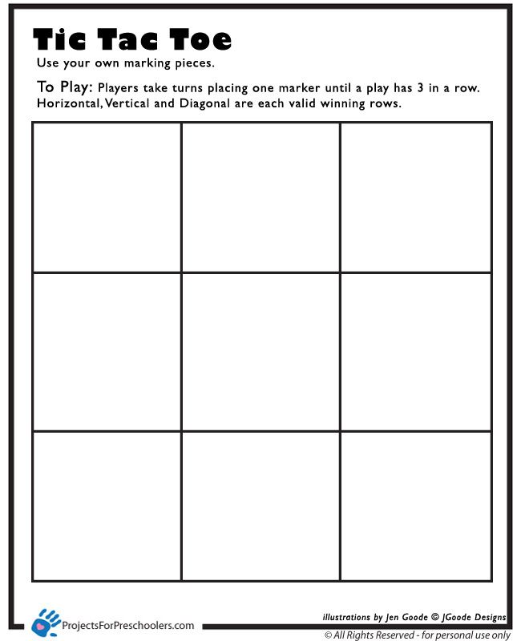
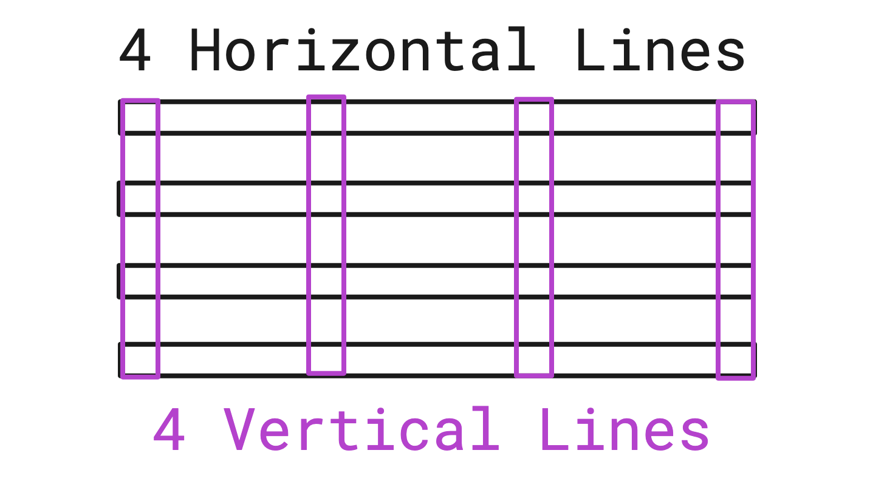
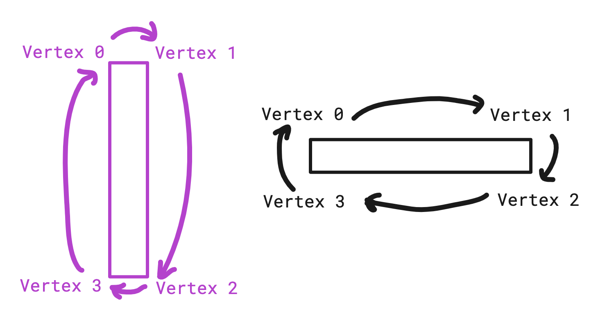
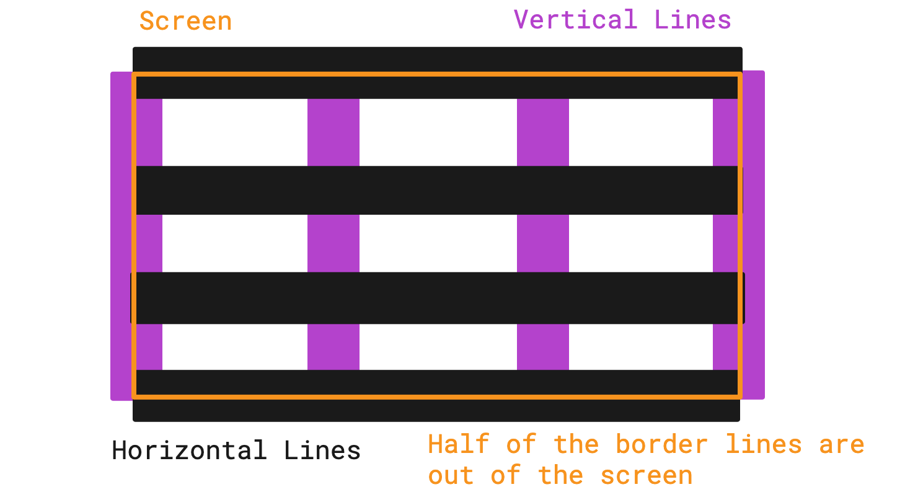
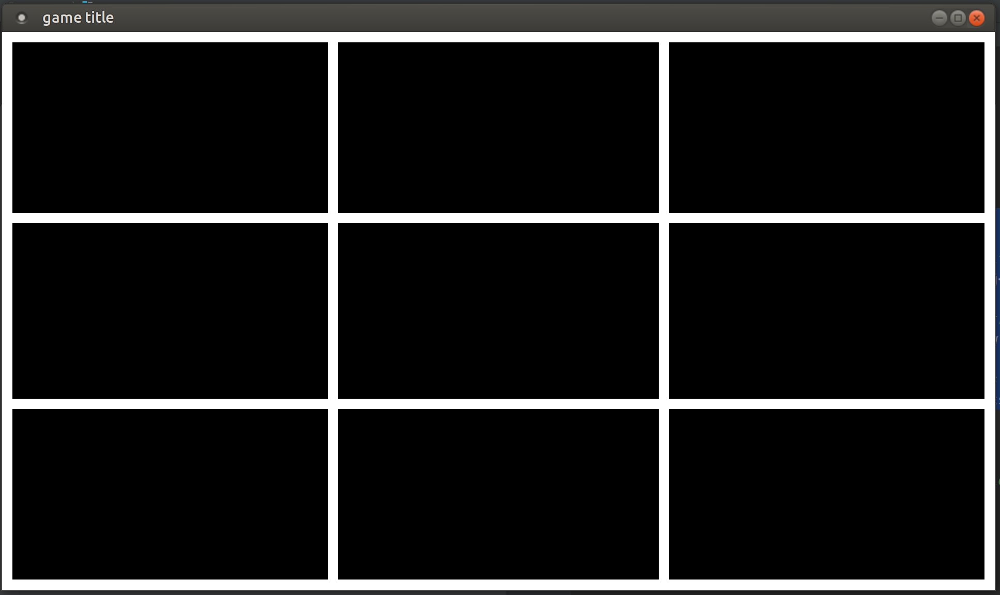

Tutorial: How to do a tic-tac-toe in less than 15 minutes with the gaming SDK ?
===============================================================================

If you have not read the :doc:`getting started<getting_started>` part yet, I invite you to do it now for the rest of this tutorial.

This tutorial is divided into several steps, to help you to follow more simply.

Step 0: setup the executable and the window
-------------------------------------------

For this first step we need a ``CMakeLists.txt`` to be able to create our executable and compile it.

In this ``CMakeLists.txt`` file we will have: the name of the project, the creation of the executable, the link with the SDK, the C++ standard that will be used and the extras modules that we want to use, in our case it will be the module  :doc:`antara::sfml<../modules/sfml>` provided by the **SDK**.

Below is the ``CMakeLists.txt`` file:

.. literalinclude:: ../../../tutorials/tic-tac-toe/step_0/CMakeLists.txt
   :language: cmake

Then we create our input file for the application and call it tic-tac-toe.cpp.

We add an empty main and a return value:

.. code-block:: cpp

    int main()
    {
        return 0;
    }

If you have followed well until then you should have the following tree:

.. code-block:: bash

    .
    ├── CMakeLists.txt
    └── tic-tac-toe.cpp

Before continuing the tutorial check that your program compiles by referring to the build commands available in the tutorial :doc:`getting started<getting_started>`.

Now we are going to need a world representing the world of our game, to do this we are going to need the following header file: ``#include <antara/gaming/world/world.app.hpp>``

And a basic structure that we name ``tic_tac_toe world`` that will inherit from an ``antara::gaming::world::app``.

As well as a using namespace ``antara::gaming`` to make naming easier.

Finally, we declare our new object in the body of the main function and we replace the return value with the return value of our game returned by the ``run`` function of the ``class world::app``

Which gives us the following result:

.. code-block:: cpp

    #include <antara/gaming/world/world.hpp>

    using namespace antara::gaming;

    struct tic_tac_toe_world : world::app
    {
        //! Our game entry point
        tic_tac_toe_world() noexcept = default;
    };

    int main()
    {
        tic_tac_toe_world game;
        return game.run();
    }

If you compile now and start your executable you have an infinite loop and nothing that happens.

The last stage of this first step is to add the graphic side of the application, for that we will need 2 modules: ``antara::gaming::sfml::graphic_system`` and ``antara::gaming::sfml::input::system``.
Who have the following headers, respectively: ``#include <antara/gaming/sfml/graphic.system.hpp>`` and ``#include <antara/gaming/sfml/input.system.hpp>``.

Now in the body of the constructor of our class tic_tac_toe_world we will load the graphic system, then the input system with the window coming from the graphic system.

Which gives us the following result:

.. literalinclude:: ../../../tutorials/tic-tac-toe/step_0/tic-tac-toe.cpp
   :language: cpp

If you compile now you should see a black window open that you can close by pressing the cross:

.. image:: ../../assets/black_window.png

And now, the first step is over. The objectives have been reached: to have a window that opens and can be closed, a basic executable and a CMakeLists.txt to be able to compile our program.

Step 1: The Game Scene, The Grid, Game constants
------------------------------------------------

For this second step our goal is to draw the grid of the tick toe.

The grid will look like this:

To do this, we will create a game scene thanks to the scene manager, so in order we will include the header file ``#include <antara/gaming/scenes/scene.manager.hpp>`` and load the scenes manager system into the system manager.

.. code-block:: cpp

    struct tic_tac_toe_world : world::app
    {
        //! Our game entry point
        tic_tac_toe_world() noexcept
        {
            //! Here we load our graphical system
            auto &graphic_system = system_manager_.create_system<sfml::graphic_system>();

            //! Here we load our input system with the window from the graphical system
            system_manager_.create_system<sfml::input_system>(graphic_system.get_window());

            //! Here we load the scenes manager
            auto &scene_manager = system_manager_.create_system<scenes::manager>();
        }
    };

Now we are going to create the game_scene class that inherits from the base_scene class. This class will be the entry point of our game scene.

The concrete class must override several functions such as updade, scene_name, and the destructor.
We will not use the update function because the tictactoe is not a game that needs an update for each frame, so we will leave the function empty.
For the scene_name function we'll just return the name of the scene.

.. code-block:: cpp

    class game_scene final : public scenes::base_scene
    {
    public:
        game_scene(entt::registry &entity_registry) noexcept : base_scene(entity_registry)
        {}

        //! This function will not be used, because tic tac toe doesn't need an update every frame.
        void update() noexcept final
        {}

        //! our scene name
        std::string scene_name() noexcept final
        {
            return "game_scene";
        }

        ~game_scene() noexcept final
        {}
    private:
    };

Now we are going to load our game scene into the scene_manager using the change_scene member function

.. code-block:: cpp

    struct tic_tac_toe_world : world::app
    {
        //! Our game entry point
        tic_tac_toe_world() noexcept
        {
            //! Here we load our graphical system
            auto &graphic_system = system_manager_.create_system<sfml::graphic_system>();

            //! Here we load our input system with the window from the graphical system
            system_manager_.create_system<sfml::input_system>(graphic_system.get_window());

            //! Here we load the scenes manager
            auto &scene_manager = system_manager_.create_system<scenes::manager>();

            //! Here we change the current_scene to "game_scene" by pushing it.
            scene_manager.change_scene(std::make_unique<game_scene>(entity_registry_), true);
        }
    };

If you compile now you should still see the black window from the previous step, but we are now in our game scene.

.. image:: ../../assets/black_window.png

.. note::

    The scene system is very handy when you want to organize your game with different screens, **introduction scene**, **game scene**, **end-of-game scene**, etc.

Now we are going to need several constant data essential for the tick-to-toe, the size of a cell in width, in height, the number of cells per line, the thickness of our grid.

For the size of the cells we will use the current size of our canvas divided by the number of cells per line to obtain the size of a cell.

So we create a structure tic_tac_toe_constants that will contain these different information.

Then we save it in the entity registry to be able to access from anywhere in the program.

.. code-block:: cpp

    struct tic_tac_toe_constants
    {
        tic_tac_toe_constants(std::size_t nb_cells_per_row_, std::size_t width_, std::size_t height_) noexcept :
                nb_cells_per_row(nb_cells_per_row_),
                cell_width(width_ / nb_cells_per_row),
                cell_height(height_ / nb_cells_per_row)
        {
        }

        const std::size_t nb_cells_per_row;
        const std::size_t cell_width;
        const std::size_t cell_height;
        const float grid_thickness{20.0f};
    };

In the constructor of the gaming scene:

.. code-block:: cpp

    game_scene(entt::registry &entity_registry) noexcept : base_scene(entity_registry)
    {
        //! Here we retrieve canvas information
        auto[canvas_width, canvas_height] = entity_registry_.ctx<graphics::canvas_2d>().canvas.size.to<math::vec2u>();

        //! Here i set the constants that will be used in the program
        entity_registry_.set<tic_tac_toe_constants>(3ull, canvas_width, canvas_height);
    }

Now we will go to the creation of our entity representing our grid, so we will add in private member of our game_scene class the ``grid_entity_`` field which is of type ``entt::entity`` which will have the initial value ``entt::null``.

.. code-block:: cpp

    class game_scene final : public scenes::base_scene
    {
    public:
        game_scene(entt::registry &entity_registry) noexcept : base_scene(entity_registry)
        {
            //! Here we retrieve canvas information
            auto[canvas_width, canvas_height] = entity_registry_.ctx<graphics::canvas_2d>().canvas.size.to<math::vec2u>();

            //! Here i set the constants that will be used in the program
            entity_registry_.set<tic_tac_toe_constants>(3ull, canvas_width, canvas_height);
        }

        //! This function will not be used, because tic tac toe doesn't need an update every frame.
        void update() noexcept final
        {}

        //! our scene name
        std::string scene_name() noexcept final
        {
            return "game_scene";
        }

        ~game_scene() noexcept final
        {}
    private:
        //! Our entity representing the tic-tac-toe grid
        entt::entity grid_entity_{entt::null};
    };

Then, we will have to initialize this entity, to do this we create an anonymous namespace with a function create_grid which returns an ``entt::entity`` and take in parameter the ``entity registry``.

.. code-block:: cpp

    //! Contains all the function that will be used for logic  and factory
    namespace
    {
        //! Factory for creating a tic-tac-toe grid
        entt::entity create_grid(entt::registry &registry) noexcept
        {
            return entt::null;
        }
    }

Now, we call the function from the game scene constructor and we assign the return value to the field ``grid_entity_``:

.. code-block:: cpp

    game_scene(entt::registry &entity_registry) noexcept : base_scene(entity_registry)
    {
        //! Here we retrieve canvas information
        auto[canvas_width, canvas_height] = entity_registry_.ctx<graphics::canvas_2d>().canvas.size.to<math::vec2u>();

        //! Here i set the constants that will be used in the program
        entity_registry_.set<tic_tac_toe_constants>(3ull, canvas_width, canvas_height);

        //! Here i create the grid of the tic tac toe
        grid_entity_ = create_grid(entity_registry_);
    }

We only have two things to do now:

- code the logic of the create_grid function
- manage the destruction of the entities of our game scene when leaving the program

Let's start by coding the logic of the create_grid function.

First we get the canvas size, because that will be the size of our grid.

.. code-block:: cpp

    //! retrieve canvas information
    auto[canvas_width, canvas_height] = registry.ctx<graphics::canvas_2d>().canvas.size;

Second, we create a new entity named grid.

.. code-block:: cpp

    //! entity creation
    auto grid_entity = registry.create();

A line is represented with two dots that we call vertex. Vertex has a X position and a Y position. Connection of two vertices makes a line. Though that line thickness then would be ``1 px``. ``1 px`` is not very visible if the image gets smaller because of scaling etc. So we want a thick line, like ``20px``. 

A thick line is basically a rectangle, right? For a rectangle, we need 4 vertices because of 4 corners. For a Tic-tac-toe grid, we need ``4 vertical lines`` (2 in middle and 2 at screen borders) and ``4 horizontal lines``. That makes ``8 lines``, and each line is ``4 vertices``, so we need ``8 * 4 = 32`` vertices.

.. code-block:: cpp

    //! our vertices
    std::vector<geometry::vertex> lines{8 * 4};

We also need information about the grid, 

``nb_cells`` = Number of cells in one axis, 3 in this case.  

``cell_width, cell_height`` = Width and height of a cell.

``grid_thickness`` = Thickness of the line.

We retrieve them from the defined constants:

.. code-block:: cpp

    //! retrieve constants information
    auto[nb_cells, cell_width, cell_height, grid_thickness] = registry.ctx<tic_tac_toe_constants>();

In calculations we will use half of the thickness more often than the thickness itself so we prepare that earlier for reuse and clarity.

.. code-block:: cpp

    const auto half_thickness = grid_thickness * 0.5f;

Our loop looks complicated but it actually isn't. At each loop we will define one vertical and one horizontal line. We have 4 lines in each axis so we need to loop 4 times, that is ``nb_cells + 1``. Though we need to start from ``0`` because that will be used for the starting coordinate. We also have a variable ``counter`` which will count the vertex indexes, it will increase by ``4 vertices * 2 lines = 8 vertices`` at each iteration.

.. code-block:: cpp

    //! our loop to create the grid
    for (std::size_t counter = 0, i = 0; i <= nb_cells; ++i, counter += 4 * 2) {

Most important information is this: ``Order of the vertices are always like this: Top Left, Top Right, Bottom Right, Bottom Left. So next neighbour is always the clockwise neighbour.``

Let's draw the vertical line first. Remember the order, we start with Top Left vertex. A vertical line is from top to bottom and ``X`` position will be same for top and bottom, but ``Y`` will change.

We calculate ``X`` first. ``idx`` is currently ``0``, if we multiply that with ``cell_width``, let's say ``cell_width`` is ``300``, in ``4`` iterations these will be the values: ``0, 300, 600, 900``. 

Then we will do ``- half_thickness`` to shift it to a bit left because left and right vertices of a thick vertical line needs to be separate. 

And the Y will be 0 because it's top of the screen. X axis grows from left to right, Y axis grows from top to down.

.. code-block:: cpp

    lines[counter + 0].pos = {idx * cell_width - half_thickness, 0.f};

Now, the Top Right vertex, it is same but it is ``+ half_thickness`` this time to make them stay far away. Y is still ``0`` because it's top of the screen.

.. code-block:: cpp

    lines[counter + 1].pos = {idx * cell_width + half_thickness, 0.f};

Now, the Bottom Right vertex, ``X`` is same with Top Right, but ``Y`` is now canvas_height which is bottom of the screen.

.. code-block:: cpp

    lines[counter + 2].pos = {idx * cell_width + half_thickness, canvas_height};

Now, the last one, Bottom Left vertex, ``Y`` is same as Bottom Right, ``X`` is doing ``- half_thickness`` because it needs to be at left.

.. code-block:: cpp

    lines[counter + 3].pos = {idx * cell_width - half_thickness, canvas_height};

We completed the vertical line! Now we will do horizontal line. Again, always imagine these lines as rectangles. We will fill next 4 vertices now. 

Starting at Top Left again, since line will be from left to right, ``x`` of left is ``0``. And ``Y`` will change like ``X`` did in vertical line, 4 horizontal lines will have ``Y`` values as: ``0, 300, 600, 900``.

Then we do ``- half_thickness`` to Y because Top Left needs to be at Top, we shift it a little bit to top to create the thickness. 

.. code-block:: cpp
    
    lines[counter + 4].pos = {0, idx * cell_height - half_thickness};

Then Top Right vertex, is at far right side, ``canvas_width`` pixels away. And ``Y`` is same as Top Left.

.. code-block:: cpp

    lines[counter + 5].pos = {canvas_width, idx * cell_height - half_thickness};

Then Bottom Right vertex, ``X`` stays the same, and this time we add thickness to shift it to bottom, to create the thickness.

.. code-block:: cpp

    lines[counter + 6].pos = {canvas_width, idx * cell_height + half_thickness};

Then the last one, Bottom Left, is at far left, ``0``. We shift ``Y`` to a bit bottom by adding thickness again.

.. code-block:: cpp

    lines[counter + 7].pos = {0, idx * cell_height + half_thickness};

Viola! Both vertical and horizontal lines are ready. Loop ends here.

After the loop, we turn these vertices to a ``geometry::vertex_array`` of quads, which are rectangles. And assign it to the ``grid_entity``.

.. code-block:: cpp

    //! assign the vertex array to the grid entity
    registry.assign<geometry::vertex_array>(grid_entity, lines, geometry::vertex_geometry_type::quads);

We tag the grid as ``game_scene``

.. code-block:: cpp

    //! assign the game_scene tag to the grid_entity (_hs means hashed_string)
    registry.assign<entt::tag<"game_scene"_hs>>(grid_entity);

Set it to appear at ``layer 0``, and return the prepared grid!

.. code-block:: cpp

    //! We want to draw the grid on the most deep layer, here 0.
    registry.assign<graphics::layer<0>>(grid_entity);

    //! we give back our fresh entity
    return grid_entity;

This will work and look really good. Though maybe you realized, we always add and substract ``half_thickness``. So the top border and left border of the screen are at coordinate ``0``, so subtracting ``half_thickness`` will make half of it to appear out of the screen. Same with bottom border and right border, they are at ``canvas_width`` and ``canvas_height`` which are and of the screen. Adding ``half_thickness`` makes the half of it appear out of the screen again. If you are perfectionist, you don't want that to happen.

To solve this, we need to treat the first and last lines in a special way. We need to push top border a bit down, left border to a bit right, bottom border to a bit up and right border to a bit left to keep them fully inside the screen. We can call that shift ``offset``, we go back to our loop and define it at start.

There is no offset by default, so we set them to ``0``.

.. code-block:: cpp

    auto offset_x = 0.0f;
    auto offset_y = 0.0f;

If it's the first ones, we add ``half_thickness`` to push them inside. And if it's last ones, we subtract ``half_thickness`` to pull them inside.

.. code-block:: cpp

    if (i == 0) {
        offset_x += half_thickness;
        offset_y += half_thickness;
    } 
    else if (i == nb_cells) {
        offset_x -= half_thickness;
        offset_y -= half_thickness;
    }

Now let's use the offsets we set.

For the vertical line, we use the ``offset X`` to push them left and right.

.. code-block:: cpp

    //! vertical
    lines[counter + 0].pos = {offset_x + idx * cell_width - half_thickness, 0.f};
    lines[counter + 1].pos = {offset_x + idx * cell_width + half_thickness, 0.f};
    lines[counter + 2].pos = {offset_x + idx * cell_width + half_thickness, canvas_height};
    lines[counter + 3].pos = {offset_x + idx * cell_width - half_thickness, canvas_height};

For the horizontal line, we use the ``offset Y`` to push them up and down.

.. code-block:: cpp

    //! horizontal
    lines[counter + 4].pos = {offset_x + 0,            offset_y + idx * cell_height - half_thickness};
    lines[counter + 5].pos = {offset_x + canvas_width, offset_y + idx * cell_height - half_thickness};
    lines[counter + 6].pos = {offset_x + canvas_width, offset_y + idx * cell_height + half_thickness};
    lines[counter + 7].pos = {offset_x + 0,            offset_y + idx * cell_height + half_thickness};

Now our grid must be looking absolutely perfect. You can edit ``grid_thickness`` constant to change the thickness of the lines.

Below the complete function:

.. code-block:: cpp

    //! Contains all the function that will be used for logic  and factory
    namespace
    {
        //! Factory for creating a tic-tac-toe grid
        entt::entity create_grid(entt::registry &registry) noexcept
        {
            //! retrieve canvas information
            auto[canvas_width, canvas_height] = registry.ctx<graphics::canvas_2d>().canvas.size;

            //! entity creation
            auto grid_entity = registry.create();

            //! our vertices
            std::vector<geometry::vertex> lines{8 * 4};

            //! retrieve constants information
            auto[nb_cells, cell_width, cell_height, grid_thickness] = registry.ctx<tic_tac_toe_constants>();
            const auto half_thickness = grid_thickness * 0.5f;

            //! our loop to create the grid
            for (std::size_t counter = 0, i = 0; i <= nb_cells; ++i, counter += 4 * 2) {

                //! to avoid narrowing conversion
                auto idx = static_cast<float>(i);

                //! first and last ones should be a bit inside, otherwise half of it is out of the screen
                auto offset_x = 0.0f;
                auto offset_y = 0.0f;

                if (i == 0) {
                    offset_x += half_thickness;
                    offset_y += half_thickness;
                } else if (i == nb_cells) {
                    offset_x -= half_thickness;
                    offset_y -= half_thickness;
                }

                //! prepare lines

                //! vertical
                lines[counter + 0].pos = {offset_x + idx * cell_width - half_thickness, 0.f};
                lines[counter + 1].pos = {offset_x + idx * cell_width + half_thickness, 0.f};
                lines[counter + 2].pos = {offset_x + idx * cell_width + half_thickness, canvas_height};
                lines[counter + 3].pos = {offset_x + idx * cell_width - half_thickness, canvas_height};

                //! horizontal
                lines[counter + 4].pos = {offset_x + 0, offset_y + idx * cell_height - half_thickness};
                lines[counter + 5].pos = {offset_x + canvas_width, offset_y + idx * cell_height - half_thickness};
                lines[counter + 6].pos = {offset_x + canvas_width, offset_y + idx * cell_height + half_thickness};
                lines[counter + 7].pos = {offset_x + 0, offset_y + idx * cell_height + half_thickness};
            }

            //! assign the vertex array to the grid entity
            registry.assign<geometry::vertex_array>(grid_entity, lines, geometry::vertex_geometry_type::quads);

            //! assign the game_scene tag to the grid_entity (_hs means hashed_string)
            registry.assign<entt::tag<"game_scene"_hs>>(grid_entity);

            //! We want to draw the grid on the most deep layer, here 0.
            registry.assign<graphics::layer<0>>(grid_entity);

            //! we give back our fresh entity
            return grid_entity;
        }
    }

The last thing to do is the destruction of the entities in the destroyer, we will need it at the time of reset the game.

We will simply in the destructor of the game scene iterate over all the entities that have the tag of the game scene, and destroy each of them.

.. code-block:: cpp

    ~game_scene() noexcept final
    {
        //! Here we retrieve the collection of entities from the game scene
        auto view = entity_registry_.view<entt::tag<"game_scene"_hs>>();

        //! Here we iterate the collection and destroy each entities
        entity_registry_.destroy(view.begin(), view.end());

        //! Here we unset the tic tac toe constants
        entity_registry_.unset<tic_tac_toe_constants>();
    }

Now if you compile and run your program you should have the following result:

Here is the complete code of the second step:

.. literalinclude:: ../../../tutorials/tic-tac-toe/step_1/tic-tac-toe.cpp
   :language: cpp