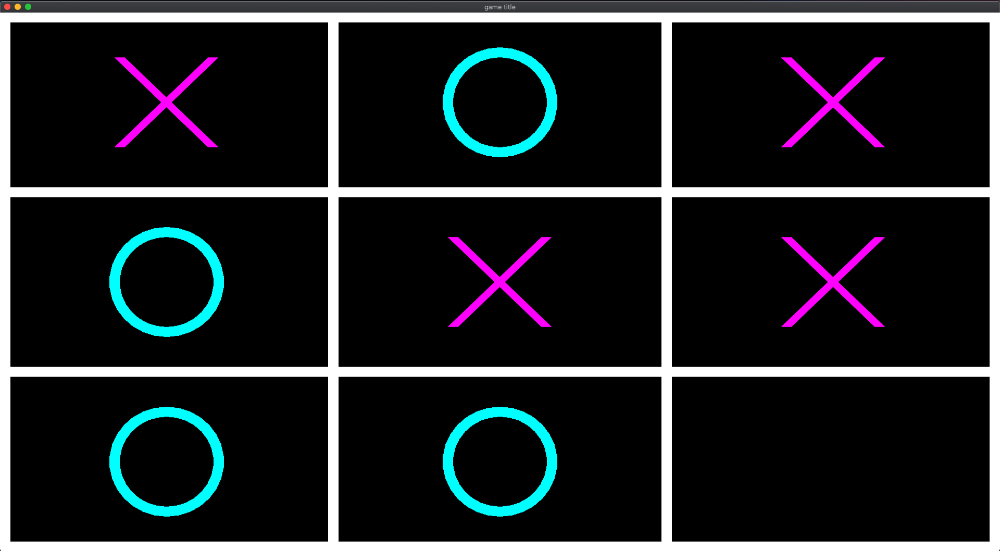
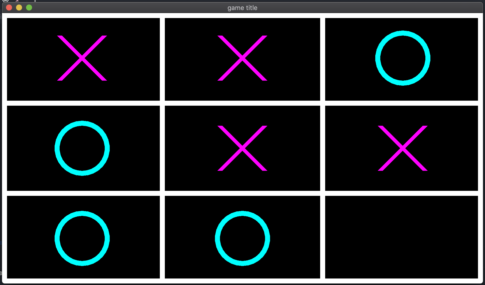
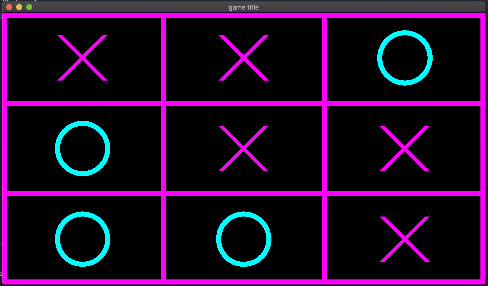
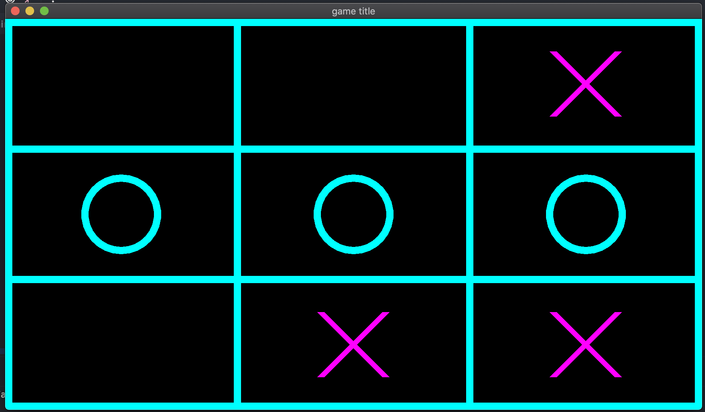
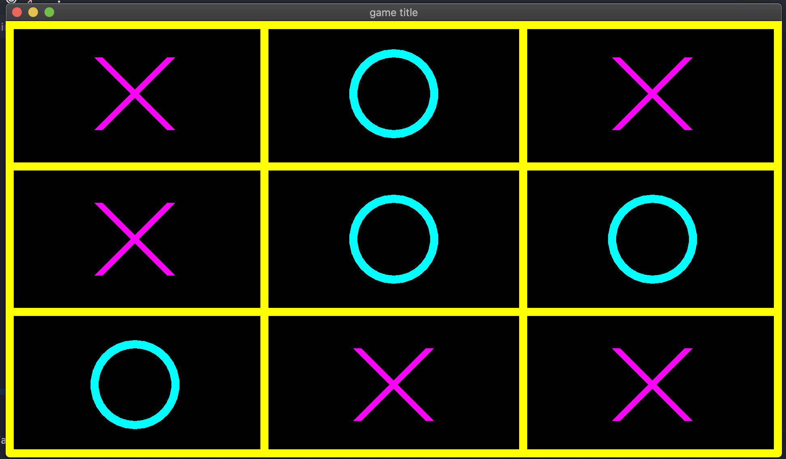

Tutorial: How to do a Tic-Tac-Toe in less than 15 minutes with the gaming SDK ?
===============================================================================

If you have not read the :doc:`getting started<getting_started>` part yet, Please read it before reading this one.

This tutorial is divided into multiple steps to make it easier to follow.

Step 1: Setup the executable and the window
-------------------------------------------

First we need a ``CMakeLists.txt`` to create and compile the executable.

In this ``CMakeLists.txt`` file we will have: name of the project, creation of the executable, link with the SDK, C++ standard that will be used and extras modules that we want to use, in our case it will be the module  :doc:`antara::sfml<../modules/sfml>` provided by the **SDK**.

Below is the ``CMakeLists.txt`` file:

.. literalinclude:: ../../../tutorials/tic-tac-toe/step_1/CMakeLists.txt
   :language: cmake

Then we create our input file for the application and call it ``tic-tac-toe.cpp``.

We add an empty main function:

.. code-block:: cpp

    int main()
    {
        return 0;
    }

If you did everything correctly so far, you should have the following tree:

.. code-block:: bash

    .
    ├── CMakeLists.txt
    └── tic-tac-toe.cpp

Before continuing the tutorial, make sure that your program compiles with the build commands available in the tutorial :doc:`getting started<getting_started>`.

Now we need a world representing the world of our game, to do this we need the following header file: ``#include <antara/gaming/world/world.app.hpp>``

And a basic structure that we name ``tic_tac_toe world``. It will inherit from ``antara::gaming::world::app`` class.

And using namespace ``antara::gaming`` to make naming easier.

Finally, we declare our new object in the body of the main function and we replace the return value with the return value of our game returned by the ``run`` function of the ``class world::app``.

It gives us the following result:

.. code-block:: cpp

    #include <antara/gaming/world/world.hpp>

    using namespace antara::gaming;

    struct tic_tac_toe_world : world::app
    {
        //! Our game entry point
        tic_tac_toe_world() noexcept = default;
    };

    int main()
    {
        tic_tac_toe_world game;
        return game.run();
    }

If you compile now and run your executable, you have an infinite loop and nothing will happen.

The last stage of this first step is to add the graphics side of the application, for that we will need two modules: ``antara::gaming::sfml::graphic_system`` and ``antara::gaming::sfml::input::system`` which have these following headers, respectively: ``#include <antara/gaming/sfml/graphic.system.hpp>`` and ``#include <antara/gaming/sfml/input.system.hpp>``.

Now in the body of the constructor of our class tic_tac_toe_world we will load the graphic system. Then we will initialize input system with the window coming from the loaded graphic system.

.. literalinclude:: ../../../tutorials/tic-tac-toe/step_1/tic-tac-toe.cpp
   :language: cpp

If you compile and run now, you should see a black window open. You can close by pressing the close button of the window:

.. image:: ../../assets/black_window.png

And now, the first step is over. We have a CMakeLists.txt to be able to compile our program into a basic executable which can create a window.

Step 2: The Game Scene, The Grid, Game constants
------------------------------------------------

For this second step, our goal is to draw the grid of Tic-Tac-Toe.

The grid will look like this:

.. image:: ../../assets/tictactoe.grid.jpg

To do this we will create a game scene using the scene manager, so in order we will include the header file ``#include <antara/gaming/scenes/scene.manager.hpp>`` and load the scenes manager system into the system manager.

.. code-block:: cpp

    struct tic_tac_toe_world : world::app
    {
        //! Our game entry point
        tic_tac_toe_world() noexcept
        {
            //! Load the graphical system
            auto &graphic_system = system_manager_.create_system<sfml::graphic_system>();

            //! Load the input system with the window from the graphical system
            system_manager_.create_system<sfml::input_system>(graphic_system.get_window());

            //! Load the scenes manager
            auto &scene_manager = system_manager_.create_system<scenes::manager>();
        }
    };

Now we are going to create the game_scene class that inherits from the base_scene class. This class will be the entry point of our game scene.

The concrete class must override several functions such as update, scene_name, and the destructor.
We will not use the update function because the Tic-Tac-Toe is not a game that needs an update for each frame, so we will leave the function empty.
For the scene_name function we'll just return the name of the scene.

.. code-block:: cpp

    class game_scene final : public scenes::base_scene
    {
    public:
        game_scene(entt::registry &entity_registry) noexcept : base_scene(entity_registry)
        {}

        //! This function will not be used, because Tic-Tac-Toe doesn't need an update every frame.
        void update() noexcept final
        {}

        //! our scene name
        std::string scene_name() noexcept final
        {
            return "game_scene";
        }

        ~game_scene() noexcept final
        {}
    private:
    };

Now we are going to load our game scene into the scene_manager using the change_scene member function

.. code-block:: cpp

    struct tic_tac_toe_world : world::app
    {
        //! Our game entry point
        tic_tac_toe_world() noexcept
        {
            //! Load the graphical system
            auto &graphic_system = system_manager_.create_system<sfml::graphic_system>();

            //! Load the input system with the window from the graphical system
            system_manager_.create_system<sfml::input_system>(graphic_system.get_window());

            //! Load the scenes manager
            auto &scene_manager = system_manager_.create_system<scenes::manager>();

            //! Change scene to game_scene
            scene_manager.change_scene(std::make_unique<game_scene>(entity_registry_), true);
        }
    };

If you compile now you should still see the black window from the previous step, but we are now in our game scene.

.. image:: ../../assets/black_window.png

.. note::

    The scene system is very handy to organize multiple screens of the game: **introduction scene**, **game scene**, **end-of-game scene**, etc.

Now we need several constants that are essential. For Tic-Tac-Toe they are: width and height of a cell, number of cells per line and thickness of the grid.

For the size of the cells we will use the current size of our canvas divided by the number of cells per line to obtain the size of a cell.

So we create a structure tic_tac_toe_constants that will contain these different information.

Then we save it in the entity registry to be able to access from anywhere in the program.

.. code-block:: cpp

    struct tic_tac_toe_constants
    {
        tic_tac_toe_constants(std::size_t nb_cells_per_axis_, std::size_t width_, std::size_t height_) noexcept :
                nb_cells_per_axis(nb_cells_per_axis_),
                cell_width(width_ / nb_cells_per_axis),
                cell_height(height_ / nb_cells_per_axis)
        {
        }

        const std::size_t nb_cells_per_axis;
        const std::size_t cell_width;
        const std::size_t cell_height;
        const float grid_thickness{20.0f};
    };

In the constructor of the gaming scene:

.. code-block:: cpp

    game_scene(entt::registry &entity_registry) noexcept : base_scene(entity_registry)
    {
        //! Retrieve canvas information
        auto[canvas_width, canvas_height] = entity_registry_.ctx<graphics::canvas_2d>().canvas.size.to<math::vec2u>();

        //! Set the constants that will be used in the program
        entity_registry_.set<tic_tac_toe_constants>(3ull, canvas_width, canvas_height);
    }

Now we will go to the creation of our entity representing our grid, so we will add in private member of our game_scene class the ``grid_entity_`` field which is of type ``entt::entity`` which will have the initial value ``entt::null``.

.. code-block:: cpp

    class game_scene final : public scenes::base_scene
    {
    public:
        game_scene(entt::registry &entity_registry) noexcept : base_scene(entity_registry)
        {
            //! Retrieve canvas information
            auto[canvas_width, canvas_height] = entity_registry_.ctx<graphics::canvas_2d>().canvas.size.to<math::vec2u>();

            //! Set the constants that will be used in the program
            entity_registry_.set<tic_tac_toe_constants>(3ull, canvas_width, canvas_height);
        }

        //! This function won't be used, because Tic-Tac-Toe doesn't need to update every frame.
        void update() noexcept final
        {}

        //! Return the scene name
        std::string scene_name() noexcept final
        {
            return "game_scene";
        }

        ~game_scene() noexcept final
        {}
    private:
        //! The entity which represents the Tic-Tac-Toe grid
        entt::entity grid_entity_{entt::null};
    };

Then, we will have to initialize this entity, to do this we create an anonymous namespace with a function ``create_grid`` which returns an ``entt::entity`` and take in parameter ``entity registry``.

.. code-block:: cpp

    //! Contains all functions which will be used for logic and factory
    namespace
    {
        //! Factory for creating a Tic-Tac-Toe grid
        entt::entity create_grid(entt::registry &registry) noexcept
        {
            return entt::null;
        }
    }

Now, we call the function from the game scene constructor and we assign the return value to the field ``grid_entity_``:

.. code-block:: cpp

    game_scene(entt::registry &entity_registry) noexcept : base_scene(entity_registry)
    {
        //! Retrieve canvas information
        auto[canvas_width, canvas_height] = entity_registry_.ctx<graphics::canvas_2d>().canvas.size.to<math::vec2u>();

        //! Set the constants that will be used in the program
        entity_registry_.set<tic_tac_toe_constants>(3ull, canvas_width, canvas_height);

        //! Create the grid of the Tic-Tac-Toe
        grid_entity_ = create_grid(entity_registry_);
    }

Only two things left to do now:

- code the logic of the create_grid function
- manage the destruction of the entities of our game scene when leaving the program

Let's start by coding the logic of the ``create_grid`` function.

First we get the canvas size, because that will be the size of our grid.

.. code-block:: cpp

    //! Retrieve canvas information
    auto[canvas_width, canvas_height] = registry.ctx<graphics::canvas_2d>().canvas.size;

Second, we create a new entity named grid.

.. code-block:: cpp

    //! Entity creation
    auto grid_entity = registry.create();

A line is represented with two dots that we call vertex. Vertex has a X position and a Y position. Connection of two vertices makes a line. Though that line thickness then would be ``1 px``. ``1 px`` is not very visible if the image gets smaller because of scaling etc. So we want a thick line, like ``20px``. 

.. image:: ../../assets/grid_lines.png

A thick line is basically a rectangle, right? For a rectangle, we need 4 vertices because of 4 corners. For a Tic-Tac-Toe grid, we need ``4 vertical lines`` (2 in middle and 2 at screen borders) and ``4 horizontal lines``. That makes ``8 lines``, and each line is ``4 vertices``, so we need ``8 * 4 = 32`` vertices.

.. code-block:: cpp

    //! Our vertices
    std::vector<geometry::vertex> lines{8 * 4};

We also need information about the grid, 

``nb_cells`` = Number of cells in one axis, 3 in this case.

``cell_width, cell_height`` = Width and height of a cell.

``grid_thickness`` = Thickness of the line.

We retrieve them from the defined constants:

.. code-block:: cpp

    //! Retrieve constants information
    auto[nb_cells, cell_width, cell_height, grid_thickness] = registry.ctx<tic_tac_toe_constants>();

In calculations we will use half of the thickness more often than the thickness itself so we prepare that earlier for reuse and clarity.

.. code-block:: cpp

    const auto half_thickness = grid_thickness * 0.5f;

Our loop looks complicated but it actually isn't. At each loop we will define one vertical and one horizontal line. We have 4 lines in each axis so we need to loop 4 times, that is ``nb_cells + 1``. Though we need to start from ``0`` because that will be used for the starting coordinate. We also have a variable ``counter`` which will count the vertex indexes, it will increase by ``4 vertices * 2 lines = 8 vertices`` at each iteration.

.. code-block:: cpp

    //! Our loop to create the grid
    for (std::size_t counter = 0, i = 0; i <= nb_cells; ++i, counter += 4 * 2) {

Most important information is this: ``Order of the vertices are always like this: Top Left, Top Right, Bottom Right, Bottom Left. So next neighbour is always the clockwise neighbour.``

.. image:: ../../assets/vertex_order.png

Let's draw the vertical line first. Remember the order, we start with Top Left vertex. A vertical line is from top to bottom and ``X`` position will be same for top and bottom, but ``Y`` will change.

We calculate ``X`` first. ``idx`` is currently ``0``, if we multiply that with ``cell_width``, let's say ``cell_width`` is ``300``, in ``4`` iterations these will be the values: ``0, 300, 600, 900``. 

Then we will do ``- half_thickness`` to shift it to a bit left because left and right vertices of a thick vertical line needs to be separate. 

And the Y will be 0 because it's top of the screen. X axis grows from left to right, Y axis grows from top to down.

.. code-block:: cpp

    lines[counter + 0].pos = {idx * cell_width - half_thickness, 0.f};

Now, the Top Right vertex, it is same but it is ``+ half_thickness`` this time to make them stay far away. Y is still ``0`` because it's top of the screen.

.. code-block:: cpp

    lines[counter + 1].pos = {idx * cell_width + half_thickness, 0.f};

Now, the Bottom Right vertex, ``X`` is same with Top Right, but ``Y`` is now canvas_height which is bottom of the screen.

.. code-block:: cpp

    lines[counter + 2].pos = {idx * cell_width + half_thickness, canvas_height};

Now, the last one, Bottom Left vertex, ``Y`` is same as Bottom Right, ``X`` is doing ``- half_thickness`` because it needs to be at left.

.. code-block:: cpp

    lines[counter + 3].pos = {idx * cell_width - half_thickness, canvas_height};

We completed the vertical line! Now we will do horizontal line. Again, always imagine these lines as rectangles. We will fill next 4 vertices now. 

Starting at Top Left again, since line will be from left to right, ``x`` of left is ``0``. And ``Y`` will change like ``X`` did in vertical line, 4 horizontal lines will have ``Y`` values as: ``0, 300, 600, 900``.

Then we do ``- half_thickness`` to Y because Top Left needs to be at Top, we shift it a little bit to top to create the thickness. 

.. code-block:: cpp
    
    lines[counter + 4].pos = {0, idx * cell_height - half_thickness};

Then Top Right vertex, is at far right side, ``canvas_width`` pixels away. And ``Y`` is same as Top Left.

.. code-block:: cpp

    lines[counter + 5].pos = {canvas_width, idx * cell_height - half_thickness};

Then Bottom Right vertex, ``X`` stays the same, and this time we add thickness to shift it to bottom, to create the thickness.

.. code-block:: cpp

    lines[counter + 6].pos = {canvas_width, idx * cell_height + half_thickness};

Then the last one, Bottom Left, is at far left, ``0``. We shift ``Y`` to a bit bottom by adding thickness again.

.. code-block:: cpp

    lines[counter + 7].pos = {0, idx * cell_height + half_thickness};

Voilà ! Both vertical and horizontal lines are ready. Loop ends here.

After the loop, we turn these vertices to a ``geometry::vertex_array`` of quads, which are rectangles. And assign it to the ``grid_entity``.

.. code-block:: cpp

    //! Assign the vertex array to the grid entity
    registry.assign<geometry::vertex_array>(grid_entity, lines, geometry::vertex_geometry_type::quads);

We tag the grid as ``game_scene``

.. code-block:: cpp

    //! Assign the game_scene tag to the grid_entity (_hs means hashed_string)
    registry.assign<entt::tag<"game_scene"_hs>>(grid_entity);

Set it to appear at ``layer 0``, and return the prepared grid!

.. code-block:: cpp

    //! We want to draw the grid on the most deep layer, here 0.
    registry.assign<graphics::layer<0>>(grid_entity);

    //! We give back our fresh entity
    return grid_entity;

This will work and look really good. Though maybe you realized, we always add and substract ``half_thickness``. So the top border and left border of the screen are at coordinate ``0``, so subtracting ``half_thickness`` will make half of it to appear out of the screen. Same with bottom border and right border, they are at ``canvas_width`` and ``canvas_height`` which are and of the screen. Adding ``half_thickness`` makes the half of it appear out of the screen again. If you are perfectionist, you don't want that to happen.

.. image:: ../../assets/border_problem.png

To solve this, we need to treat the first and last lines in a special way. We need to push top border a bit down, left border to a bit right, bottom border to a bit up and right border to a bit left to keep them fully inside the screen. We can call that shift ``offset``, we go back to our loop and define it at start.

There is no offset by default, so we set them to ``0``.

.. code-block:: cpp

    auto offset_x = 0.0f;
    auto offset_y = 0.0f;

If it's the first ones, we add ``half_thickness`` to push them inside. And if it's last ones, we subtract ``half_thickness`` to pull them inside.

.. code-block:: cpp

    if (i == 0) {
        offset_x += half_thickness;
        offset_y += half_thickness;
    } 
    else if (i == nb_cells) {
        offset_x -= half_thickness;
        offset_y -= half_thickness;
    }

Now let's use the offsets we set.

For the vertical line, we use the ``offset X`` to push them left and right.

.. code-block:: cpp

    //! Vertical
    lines[counter + 0].pos = {offset_x + idx * cell_width - half_thickness, 0.f};
    lines[counter + 1].pos = {offset_x + idx * cell_width + half_thickness, 0.f};
    lines[counter + 2].pos = {offset_x + idx * cell_width + half_thickness, canvas_height};
    lines[counter + 3].pos = {offset_x + idx * cell_width - half_thickness, canvas_height};

For the horizontal line, we use the ``offset Y`` to push them up and down.

.. code-block:: cpp

    //! Horizontal
    lines[counter + 4].pos = {offset_x + 0,            offset_y + idx * cell_height - half_thickness};
    lines[counter + 5].pos = {offset_x + canvas_width, offset_y + idx * cell_height - half_thickness};
    lines[counter + 6].pos = {offset_x + canvas_width, offset_y + idx * cell_height + half_thickness};
    lines[counter + 7].pos = {offset_x + 0,            offset_y + idx * cell_height + half_thickness};

Now our grid must be looking absolutely perfect. You can edit ``grid_thickness`` constant to change the thickness of the lines.

Below the complete function:

.. code-block:: cpp

    //! Contains all the function that will be used for logic and factory
    namespace
    {
        //! Factory for creating a Tic-Tac-Toe grid
        entt::entity create_grid(entt::registry &registry) noexcept
        {
            //! Retrieve canvas information
            auto[canvas_width, canvas_height] = registry.ctx<graphics::canvas_2d>().canvas.size;

            //! Entity creation
            auto grid_entity = registry.create();

            //! Our vertices
            std::vector<geometry::vertex> lines{8 * 4};

            //! Retrieve constants information
            auto[nb_cells, cell_width, cell_height, grid_thickness] = registry.ctx<tic_tac_toe_constants>();
            const auto half_thickness = grid_thickness * 0.5f;

            //! Our loop to create the grid
            for (std::size_t counter = 0, i = 0; i <= nb_cells; ++i, counter += 4 * 2) {

                //! To avoid narrowing conversion
                auto idx = static_cast<float>(i);

                //! First and last ones should be a bit inside, otherwise half of it is out of the screen
                auto offset_x = 0.0f;
                auto offset_y = 0.0f;

                if (i == 0) {
                    offset_x += half_thickness;
                    offset_y += half_thickness;
                } else if (i == nb_cells) {
                    offset_x -= half_thickness;
                    offset_y -= half_thickness;
                }

                //! Prepare lines

                //! Vertical
                lines[counter + 0].pos = {offset_x + idx * cell_width - half_thickness, 0.f};
                lines[counter + 1].pos = {offset_x + idx * cell_width + half_thickness, 0.f};
                lines[counter + 2].pos = {offset_x + idx * cell_width + half_thickness, canvas_height};
                lines[counter + 3].pos = {offset_x + idx * cell_width - half_thickness, canvas_height};

                //! Horizontal
                lines[counter + 4].pos = {offset_x + 0, offset_y + idx * cell_height - half_thickness};
                lines[counter + 5].pos = {offset_x + canvas_width, offset_y + idx * cell_height - half_thickness};
                lines[counter + 6].pos = {offset_x + canvas_width, offset_y + idx * cell_height + half_thickness};
                lines[counter + 7].pos = {offset_x + 0, offset_y + idx * cell_height + half_thickness};
            }

            //! Assign the vertex array to the grid entity
            registry.assign<geometry::vertex_array>(grid_entity, lines, geometry::vertex_geometry_type::quads);

            //! Assign the game_scene tag to the grid_entity (_hs means hashed_string)
            registry.assign<entt::tag<"game_scene"_hs>>(grid_entity);

            //! We want to draw the grid on the most deep layer, here 0.
            registry.assign<graphics::layer<0>>(grid_entity);

            //! We give back our fresh entity
            return grid_entity;
        }
    }

The last thing to do is the destruction of the entities in the destructor, we will need it at the time of reset the game.

In the destructor, we iterate over all the entities that have the tag of the game scene, and destroy each of them.

.. code-block:: cpp

    ~game_scene() noexcept final
    {
        //! Retrieve the collection of entities from the game scene
        auto view = entity_registry_.view<entt::tag<"game_scene"_hs>>();

        //! Iterate the collection and destroy each entities
        entity_registry_.destroy(view.begin(), view.end());

        //! Unset the Tic-Tac-Toe constants
        entity_registry_.unset<tic_tac_toe_constants>();
    }

Now if you compile and run your program you should have the following result:

.. image:: ../../assets/tictactoe_real_grid.png

Here is the complete code of the second step:

.. literalinclude:: ../../../tutorials/tic-tac-toe/step_2/tic-tac-toe.cpp
   :language: cpp

Step 3: Create Board and X O, Game Logic
----------------------------------------

First we need ``cell_state`` to tell if the cell is empty, marked x or y. It's good to name these with ``enum``.

.. code-block:: cpp

    enum cell_state
    {
        empty,
        player_x = 1,
        player_y = 2
    };

Now we will create the board which is ``3x3``. We store value ``3`` in ``nb_cells_per_axis`` so we will use that. Board is a ``vector`` of 9 ``cell_state`` instances and all of them are marked as empty.

.. code-block:: cpp

    std::vector<cell_state> create_board(std::size_t nb_cells_per_axis)
    {
        std::vector<cell_state> board(nb_cells_per_axis * nb_cells_per_axis, cell_state::empty);
        return board;
    }

We also need to display X and O, let's prepare X first. Function will have ``row`` and ``column`` parameters. 

.. code-block:: cpp

    void create_x(entt::registry &entity_registry, std::size_t row, std::size_t column) noexcept

Now we get the constants like ``nb_cells``, ``cell_width``, ``cell_height`` and ``grid_thickness``. Then create other helpful constants as ``half_box_side``, ``center_x``, ``center_y`` which is the center position of that specific cell.

.. code-block:: cpp

    auto[nb_cells, cell_width, cell_height, grid_thickness] = entity_registry.ctx<tic_tac_toe_constants>();
    const auto half_box_side = static_cast<float>(std::fmin(cell_width, cell_height) * 0.25f);
    const auto center_x = static_cast<float>(cell_width * 0.5 + column * cell_width);
    const auto center_y = static_cast<float>(cell_height * 0.5 + row * cell_height);

We can make a X with two lines. Just like in Step 2, every line is a quad which has 4 vertices.

.. code-block:: cpp

    auto x_entity = entity_registry.create();
    std::vector<geometry::vertex> lines{2 * 4};

X will have magenta color. We need to set every vertex color for it.

.. code-block:: cpp

    for (auto &&current_vertex: lines) current_vertex.pixel_color = graphics::magenta;

Again, just like in Step 2, we set the position of every single vertex. Order is Top Left, Top Right, Bottom Left, Bottom Right.

.. code-block:: cpp

    // Top-left to Bottom-right
    lines[0].pos = {center_x - half_box_side - half_thickness, center_y - half_box_side};
    lines[1].pos = {center_x - half_box_side + half_thickness, center_y - half_box_side};
    lines[2].pos = {center_x + half_box_side + half_thickness, center_y + half_box_side};
    lines[3].pos = {center_x + half_box_side - half_thickness, center_y + half_box_side};

    // Top-right to Bottom-left
    lines[4].pos = {center_x + half_box_side - half_thickness, center_y - half_box_side};
    lines[5].pos = {center_x + half_box_side + half_thickness, center_y - half_box_side};
    lines[6].pos = {center_x - half_box_side + half_thickness, center_y + half_box_side};
    lines[7].pos = {center_x - half_box_side - half_thickness, center_y + half_box_side};

Create a ``geometry::vertex_array`` out of it.

.. code-block:: cpp

    entity_registry.assign<geometry::vertex_array>(x_entity, lines, geometry::vertex_geometry_type::quads);

Assign this X entity as ``player_x`` and ``game_scene``. Then set layer 1, because layer 0 is the background. X and O needs to render in front.

.. code-block:: cpp

    entity_registry.assign<entt::tag<"game_scene"_hs>>(x_entity);
    entity_registry.assign<entt::tag<"player_x"_hs>>(x_entity);
    entity_registry.assign<graphics::layer<1>>(x_entity);

Now X is complete and it's turn of O. First part is same as X.

.. code-block:: cpp

    void create_o(entt::registry &entity_registry, std::size_t row, std::size_t column) noexcept
    {
        auto constants = entity_registry.ctx<tic_tac_toe_constants>();
        const auto half_box_side = static_cast<float>(std::fmin(constants.cell_width, constants.cell_height) * 0.25f);
        const auto center_x = static_cast<float>(constants.cell_width * 0.5 + column * constants.cell_width);
        const auto center_y = static_cast<float>(constants.cell_height * 0.5 + row * constants.cell_height);

To create the O, we create an entity first. Then assign it as a Circle, ``geometry::circle``. After that, set the ``fill_color`` and ``outline_color``. And finally set the entity position to center of the cell.

.. code-block:: cpp

    auto o_entity = geometry::blueprint_circle(entity_registry, half_box_side, graphics::transparent,
            transform::position_2d(center_x, center_y),
            graphics::outline_color(constants.grid_thickness, graphics::cyan));

Last part is same as X, assigning to ``game_scene`` and set layer 1.

.. code-block:: cpp

    entity_registry.assign<entt::tag<"game_scene"_hs>>(o_entity);
    entity_registry.assign<graphics::layer<1>>(o_entity);

Now the last part, we need to create a ecs::logic_update_system, we call it ``tic_tac_toe_logic``.

.. code-block:: cpp

    class tic_tac_toe_logic final : public ecs::logic_update_system<tic_tac_toe_logic>
    {
    public:
        ~tic_tac_toe_logic() noexcept final = default;

        void update() noexcept final
        {}

As you see above, we don't do anything in update function because Tic-Tac-Toe is a passive game. We need to update only when mouse is clicked. But first let's define the ``play_turn`` function.

.. code-block:: cpp

    //! Game logic
    void play_turn(std::size_t row, std::size_t column) noexcept

We turn row and column to index. 

.. code-block:: cpp

    //! Retrieve constants
    auto constants = entity_registry_.ctx<tic_tac_toe_constants>();

    //! Which cell is clicked ?
    std::size_t index = row * constants.nb_cells_per_axis + column;

Then we make sure that index is inside the board and the clicked cell is empty. If so, we set the board as the current ``player_turn_``. If it's X, we call ``create_x`` else we call ``create_o`` for that specific cell. Then change the turn to the other player.

.. code-block:: cpp

        //! Cell is available ?
        if (index < board_.size() && board_[index] == cell_state::empty) {

            //! Change state of the cell to the current player
            board_[index] = static_cast<cell_state>(player_turn_);

            //! Create x or o based on the current player
            player_turn_ == x ? create_x(entity_registry_, row, column) : create_o(entity_registry_, row, column);

            //! Switch player
            player_turn_ = (player_turn_ == player::x) ? player::o : player::x;
        }
    }

We call ``play_turn`` with the position of the mouse click.
 
.. code-block:: cpp

   void on_mouse_button_pressed(const event::mouse_button_pressed &evt) noexcept
    {
        if (current_game_state_ == running) {
            //! Retrieve game constants.
            auto constants = entity_registry_.ctx<tic_tac_toe_constants>();

            //! Play one turn of the Tic-Tac-Toe
            play_turn(evt.y / constants.cell_height, evt.x / constants.cell_width);
        } else {
            //! Here we reset the game
        }
    }

Now we assign the ``on_mouse_button_pressed`` event to the mouse click in the constructor.

.. code-block:: cpp

    tic_tac_toe_logic(entt::registry &registry, entt::entity grid_entity, std::vector<cell_state> board) noexcept
            : system(registry), grid_entity_(grid_entity), board_(std::move(board))
    {
        //! stateless system
        this->disable();

        //! subscribe to mouse_button event
        this->dispatcher_.sink<event::mouse_button_pressed>().connect<&tic_tac_toe_logic::on_mouse_button_pressed>(
                *this);
    }

In the same class, we have enums ``game_state`` and ``player`` too.

.. code-block:: cpp

    //! Private enums
    enum game_state
    {
        running,
        player_x_won = 1,
        player_y_won = 2,
        tie,
        quit
    };

    enum player
    {
        x = 1,
        o = 2
    };

And the other member variables we used such as grid, state board, game state and player turn.

.. code-block:: cpp

    //! Private members variable
    entt::entity grid_entity_{entt::null};
    std::vector<cell_state> board_;
    game_state current_game_state_{game_state::running};
    player player_turn_{player::x};

After the class definition, we give a name to our system, out of the class scope.

.. code-block:: cpp

    //! Give a name to our system
    REFL_AUTO(type(tic_tac_toe_logic));

In the constructor of the game_scene we defined before, we create the board and the logic system.

.. code-block:: cpp

    //! Create the board of the tic tac toe
    auto board = create_board(tictactoe_constants.nb_cells_per_axis);

    //! Create our logic game system and give the fresh grid entity and the fresh board.
    this->system_manager_.create_system<tic_tac_toe_logic>(grid_entity, board);

Game logic, board and XO, all of them are now complete.

Here is the complete code of the third step:

.. literalinclude:: ../../../tutorials/tic-tac-toe/step_3/tic-tac-toe.cpp
   :language: cpp

Step 4: Win, Tie conditions and reset game
------------------------------------------

At this final step, for this program to become a real game, we need to add win, tie conditions and the reset game functionality.

Let's create a blank ``reset_event``.

.. code-block:: cpp

    struct reset_event
    {

    };

And define the reset event callback, it will call the destructor and call the constructor again.

.. code-block:: cpp

    //! Callback
    void on_reset_event(const reset_event &) noexcept
    {
        entt::registry &registry = this->entity_registry_;
        this->~game_scene();
        new(this) game_scene(registry);
    }

We subscribe to this reset event in ``game_scene`` constructor.

.. code-block:: cpp

    class game_scene final : public scenes::base_scene
    {
    public:
        game_scene(entt::registry &entity_registry) noexcept : base_scene(entity_registry)
        {
            //! Subscribe to reset event
            this->dispatcher_.sink<reset_event>().connect<&game_scene::on_reset_event>(*this);

And we remove this event in the class destructor.

.. code-block:: cpp

    ~tic_tac_toe_logic() noexcept final
    {
        this->dispatcher_.sink<event::mouse_button_pressed>().disconnect(*this);
    }            

Then we trigger this when mouse button is pressed and game state isn't ``running``.

.. code-block:: cpp

    this->dispatcher_.trigger<reset_event>();

    ---------

    void on_mouse_button_pressed(const event::mouse_button_pressed &evt) noexcept
    {
        if (current_game_state_ == running) {
            //! Retrieve game constants.
            auto constants = entity_registry_.ctx<tic_tac_toe_constants>();

            //! Play one turn of the Tic-Tac-Toe
            play_turn(evt.y / constants.cell_height, evt.x / constants.cell_width);
        } else {
            //! Reset the game
            this->dispatcher_.trigger<reset_event>();
        }
    }

We nicely set-up the reset game functionality. 

Now we need to define the checks for win and tie conditions. Let's start with the winning condition. It's enough to check only the current player's win situation. In this function we check every cell and count how many of them are marked as current player, separately in two variables ``row_count`` and ``column_count``. If any of these two reached to ``nb_cells`` which is ``3``, it's a win, we return true. Then we count both diagonal lines and check the same thing. If none of these match 3, it's not a win yet, returning false.

.. code-block:: cpp

    [[nodiscard]] bool did_current_player_win_the_game() const noexcept
    {
        std::size_t row_count{0u}, column_count{0u}, diag1_count{0u}, diag2_count{0u};
        auto[nb_cells, cell_width, cell_height, _] = entity_registry_.ctx<tic_tac_toe_constants>();
        for (std::size_t i = 0; i < nb_cells; ++i) {
            for (std::size_t j = 0; j < nb_cells; ++j) {
                //! Check rows
                if (board_[i * nb_cells + j] == static_cast<cell_state>(player_turn_))
                    row_count++;

                //! Check columns
                if (board_[j * nb_cells + i] == static_cast<cell_state>(player_turn_))
                    column_count++;
            }

            //! Check condition
            if (row_count >= nb_cells || column_count >= nb_cells) {
                return true;
            }

            //! Reset rows and columns
            row_count = 0u, column_count = 0u;

            //! Diag1 count
            if (board_[i * nb_cells + i] == static_cast<cell_state>(player_turn_))
                diag1_count++;

            //! Second diag count
            if (board_[i * nb_cells + nb_cells - i - 1] == static_cast<cell_state>(player_turn_))
                diag2_count++;
        }

        //! Condition
        return diag1_count >= nb_cells || diag2_count >= nb_cells;
    }

So we will check the winning condition first. If it's not a win, and if all cells are filled, then it's a tie. So tie implementation is really easy.

.. code-block:: cpp

    [[nodiscard]] bool is_tie() const noexcept
    {
        return std::count(begin(board_), end(board_), cell_state::empty) == 0;
    }

Now we will use these two condition check functions in a bigger function which will be called later. 

.. code-block:: cpp

    void check_winning_condition() noexcept

Inside it, we define a functor ``make_screen`` inside, which sets the color of the grid.

.. code-block:: cpp

    auto make_screen = [this](graphics::color clr_winner,
                                entt::entity entity) {
        auto &array_cmp = this->entity_registry_.get<geometry::vertex_array>(entity);
        for (auto &v : array_cmp.vertices) v.pixel_color = clr_winner;
        entity_registry_.replace<geometry::vertex_array>(entity, array_cmp.vertices, array_cmp.geometry_type);
    };

Using this functor, we make another one ``make_player_win_screen`` which gives the winner's color as an argument.

.. code-block:: cpp

    auto make_player_win_screen = [this, make_screen](entt::entity entity) {
        auto winning_color = player_turn_ == player::x ? graphics::magenta : graphics::cyan;
        make_screen(winning_color, entity);
    };

Same way, another one which feeds another color when it's tie.

.. code-block:: cpp

    auto make_tie_screen = [make_screen](entt::entity entity) {
        make_screen(graphics::yellow, entity);
    };
    
Now let's use these two. First, we need to check if current player won the game, if not, we check if it isn a tie. Depending on that, we set the game state and call the proper functor we defined earlier.

.. code-block:: cpp

    if (did_current_player_win_the_game()) {
        current_game_state_ = static_cast<game_state>(player_turn_);
        make_player_win_screen(grid_entity_);
    } else if (is_tie()) {
        current_game_state_ = game_state::tie;
        make_tie_screen(grid_entity_);
    }

This function ``check_winning_condition`` looks like this when we sum it up:

.. code-block:: cpp

    void check_winning_condition() noexcept
    {
        auto make_screen = [this](graphics::color clr_winner,
                                  entt::entity entity) {
            auto &array_cmp = this->entity_registry_.get<geometry::vertex_array>(entity);
            for (auto &v : array_cmp.vertices) v.pixel_color = clr_winner;
            entity_registry_.replace<geometry::vertex_array>(entity, array_cmp.vertices, array_cmp.geometry_type);
        };

        auto make_player_win_screen = [this, make_screen](entt::entity entity) {
            auto winning_color = player_turn_ == player::x ? graphics::magenta : graphics::cyan;
            make_screen(winning_color, entity);
        };

        auto make_tie_screen = [make_screen](entt::entity entity) {
            make_screen(graphics::yellow, entity);
        };

        if (did_current_player_win_the_game()) {
            current_game_state_ = static_cast<game_state>(player_turn_);
            make_player_win_screen(grid_entity_);
        } else if (is_tie()) {
            current_game_state_ = game_state::tie;
            make_tie_screen(grid_entity_);
        }
    }

And finally we call this function in the end of ``play_turn``. 

.. code-block:: cpp

    void play_turn(std::size_t row, std::size_t column) noexcept
    {
        //! Retrieve constants
        auto constants = entity_registry_.ctx<tic_tac_toe_constants>();

        //! Which cell is clicked ?
        std::size_t index = row * constants.nb_cells_per_axis + column;

        //! Cell is available ?
        if (index < board_.size() && board_[index] == cell_state::empty) {

            //! Change state of the cell to the current player
            board_[index] = static_cast<cell_state>(player_turn_);

            //! Create x or o based on the current player
            player_turn_ == x ? create_x(entity_registry_, row, column) : create_o(entity_registry_, row, column);

            //! Check winning condition
            check_winning_condition();

            //! Switch player
            player_turn_ = (player_turn_ == player::x) ? player::o : player::x;
        }
    }

That's it! Here are the screenshots:

During the match:

When Player X wins:

When Player O wins:

When it's a tie!

Here is the complete code of the last step:

.. literalinclude:: ../../../tutorials/tic-tac-toe/step_4/tic-tac-toe.cpp
   :language: cpp
